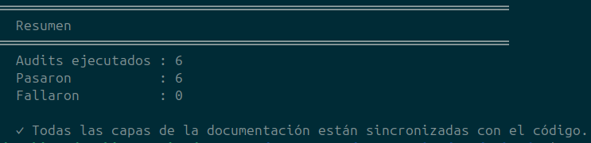

# Arquitectura interna: librerías + dispatch polimórfico

A partir de v0.1.0 el árbol `src/` se compila en cuatro
artefactos: el binario `SciNodes` (que une todo) y tres
librerías estáticas internas que aíslan responsabilidades.

## Las tres librerías internas

```
scinodes_units   (sin dependencias del proyecto)
    └─ src/core/Unit.cpp + Quantity.cpp + UnitParser.cpp
       + UnitCatalog.cpp

scinodes_graph   (depende de scinodes_units)
    └─ src/core/NodeType.cpp + NodeInstance.cpp + NodeGraph.cpp
       + GrammarParser.cpp + Field.cpp + DimensionalAnalyzer.cpp
       + UndoRedoStack.cpp + CustomNodeRegistry.cpp

scinodes_plots   (depende de scinodes_graph, ImGui)
    └─ src/ui/plots/Wave + Phase + Spectrum + Heatmap
       + Histogram renderers
```

`scinodes_units` define `struct Unit` (los 8 exponentes SI +
magnitud) y `struct Quantity` (`valor + Unit`), las dos piezas del
análisis dimensional. Los renderers de `scinodes_plots` comparten un
`struct ZoomState` (`src/ui/plots/`) con el estado de pan/zoom de
cada plot.

`SciNodes` (binario) las consume y agrega lo que requiere
Vulkan / SDL2 / glTF / Scilab (los paneles, los backends, el
visor 3-D, la persistencia, el bridge). La regla de
dependencias es **acíclica y vertical**: `units → graph →
plots → SciNodes`.

Esta separación deja construir binarios auxiliares linkeando
sólo lo necesario, sin arrastrar SDL ni Vulkan:

- En el build de CMake: `test_grammar`, `test_canvas`,
  `test_i18n`, `test_example_library`, `test_contracts`,
  `dump_catalog`, `audit_examples`.
- Fuera del build (compilación manual documentada en su
  header): `tools/example_library_query.cpp` — diagnóstico
  CLI sobre `LinearExampleLibrary`.

La suite `test_grammar` corre en milisegundos porque sólo
enlaza `scinodes_units + scinodes_graph`; lo mismo para
`audit_examples` (ver los *targets* en
[Sistema de compilación](build-system.md)).

## `FieldDef`: la unidad de parámetro+puerto unificada

Dentro de `scinodes_graph` vive `FieldDef`, la unidad mínima
del análisis dimensional. Reemplazó la dupla `ParamDef` +
`portUnit` que existía antes de v0.0.9 con una sola
declaración que cubre los dos casos:

```cpp
struct FieldDef {
    std::string name;
    FieldKind   kind;     // ideal (escalar puro) | physical (con Unit)
    Unit        unit;     // canónica del field
    Quantity    default_; // valor + unidad iniciales
};
```

`FieldKind::ideal` cubre ganancias, factores y exponentes que
deben quedar adimensionales; `FieldKind::physical` cubre todo
lo que participa en R7. Cada `NodeDef` declara sus fields y
el `DimensionalAnalyzer` los consume para inferir unidades
forward+backward.

## La biblioteca de ejemplos: `IExampleLibrary`

Los grafos de ejemplo (los que aparecen en `Archivo →
Ejemplos`) se cargan a través de una interface, no de un
directorio hardcoded:

```cpp
class IExampleLibrary {
public:
    virtual std::vector<ExampleEntry> list() const = 0;
    virtual std::string read(const std::string& id) const = 0;
};
```

La implementación canónica es `LinearExampleLibrary`, que
itera la metadata embebida (sin necesidad de `index.json`
externo). Pensada para sustituir por una backend remota o
una que sintetice ejemplos al vuelo, sin cambiar el
`ExamplesBrowser` que la consume.

## Dispatch polimórfico sobre `NodeKind`

El dispatch sobre tipos de nodo dejó de ser un `switch
(node.type)` repetido por toda la base de código y se
convirtió en una **jerarquía cerrada de `Kind`s** sobre
`std::variant`:

```cpp
struct BuiltinKind          { ... }; // nodo del catálogo built-in
struct CustomKind           { ... }; // nodo definido en JSON (runtime)
struct SubGraphContainerKind{ ... }; // el SubGraph que contiene otro grafo
struct SubGraphInputKind    { ... }; // stub de entrada en la frontera
struct SubGraphOutputKind   { ... }; // stub de salida en la frontera

using NodeKind = std::variant<
    BuiltinKind, CustomKind, SubGraphContainerKind,
    SubGraphInputKind, SubGraphOutputKind>;
```

Los pasos del editor (gramática, codegen, walker 3-D, análisis
dimensional, checks de custom nodes) se implementan como
visitors:

```cpp
auto units = std::visit(InferUnitsVisitor{...}, kind);
auto plan  = std::visit(PlanNodeVisitor{...}, kind);
auto eval  = std::visit(EvalVec3Visitor{...}, kind);
```

La regla es: **un solo `discriminator boundary`** en la capa
de bridge (`kindOf(node.type)` mapea `NodeType` → `NodeKind`).
A partir de ahí, los `switch`s desaparecen. Agregar un
NodeType nuevo significa definir su `Kind` (si no encaja en uno
existente) y sus implementaciones para los visitors; el
compilador exige cobertura total.

## Split de los archivos grandes

Tres componentes que pasaban los 1500 LOC se dividen por
responsabilidad:

- **`NodeCanvas`** → backbone + popup handlers + selection +
  shortcuts.
- **`View3DPanel`** → panel base + mesh procedural + asset
  glTF.
- **`NativeNodeRenderer`** → backbone + link drawing + style +
  interaction.

Ningún archivo del repo supera los 1000 LOC tras este split.

## La cáscara de la aplicación: paneles, contexto y reloj

Sobre el núcleo y la UI se apoya la capa de aplicación (`src/app/`),
que ensambla la ventana y organiza los paneles. `AppWindow` es solo el
ensamblador; el resto son piezas con una responsabilidad única:

- **`IPanel`** (`PanelInterface.hpp`) — la interfaz *Strategy* de la UI.
  Cada panel concreto (editor de nodos, vista 3-D, plots, outliner) la
  implementa y expone solo el *qué* (contenido vía `drawContent()` y
  metadatos); el *cómo* (abrir el window de `ImGui`, el menú de
  selección) lo maneja el host. **`PanelRegistry`** guarda los paneles
  disponibles y resuelve `typeId → IPanel*`. Cualquier área del layout
  puede mostrar cualquier panel, al estilo Blender.
- **`IPanelContext`** (implementada por `AppWindow`; `PanelContext`
  provee el default nulo) — invierte la dependencia (DIP): en vez de
  pasar refs sueltas a `NodeCanvas` + `ScilabBridge`, los paneles se
  construyen contra una abstracción que expone el grafo activo, el
  bridge de simulación, el cache de assets 3-D, el resolver de escena
  (`ISceneAssetResolver`) y el catálogo de contratos. Permite testear un
  panel sin GUI con un mock.
- **`WorkspaceManager`** — administra los presets de layout (`Design`,
  `Simulation2D`, `Simulation3D`) y la barra de tabs que conmuta entre
  ellos; cada workspace es una estrategia de asignación `IPanel → Area`
  más posiciones del DockBuilder. Saca de `AppWindow` las ~80 líneas de
  layouts hardcodeados (SRP).
- **`FrameClock`** — desacopla la medición del frame loop. El loop de
  `AppWindow` queda como cuatro fases (input, update, render, present)
  medidas por separado; `tick()` devuelve el delta-time en segundos con
  `steady_clock`, inmune a ajustes del reloj del sistema (NTP, DST).

## Internacionalización (`I18n`)

La traducción es un servicio global mínimo basado en JSON plano. Cada
idioma vive en `i18n/<lang>.json` con claves separadas por punto
(`{"menu.file.new": "Nuevo", …}`) y todo el proyecto consulta vía la
función libre `tr("menu.file.new")`. Si la clave no está en el idioma
activo, `I18n` devuelve un fallback derivado del último segmento del key
(`menu.file.new → "New"`) — sin crash, dando feedback visual de qué
falta traducir. `es.json` y `en.json` son tablas explícitas y simétricas
(lo verifica la capa 10 del audit). `I18n` es un singleton
(`I18n::instance()`); el cambio de idioma en runtime (`load(lang)`) no
requiere reinicio porque `ImGui` re-llama `tr()` cada frame. El idioma
por defecto es `es`, con override por la variable de entorno
`SCINODES_LANG`.

## Validación: la auditoría doc ↔ código

La sincronización entre la documentación y el código se verifica
con `tools/audit_all.sh`, que corre varias capas agrupadas. Las
primeras usan tres estrategias independientes (PARSE, INTROSPECT,
RUNTIME) en `tools/triple_audit.py` para cruzar el catálogo de
nodos, los tests, los menús, los atajos y los paneles; las demás
cubren el CHANGELOG, las APIs públicas, el formato `.scn`, las
*keys* de i18n, las reglas de gramática, las dependencias del
*build* y los controles de simulación, todo contra el *doc-as-db*
(`doc/db/*.json`). Cada capa **falla** ante drift real, y un *hook*
de pre-commit (`tools/githooks/pre-commit`) bloquea el commit hasta
que todo coincide.

El inventario exhaustivo que antes vivía en un `features.md` aparte
quedó absorbido por estas capas: el catálogo, los atajos, los menús y
las APIs se verifican ahora directamente contra el código, sin un
documento espejo que mantener a mano. La comparación con Xcos
(`xcos_comparison/`) no es parte del manual —pertenece a la tesis, que
es donde se argumenta— y este manual describe SciNodes en sus propios
términos.

<figure>
  
  <figcaption>Salida de <code>bash tools/audit_all.sh</code> — todas las capas de la documentación en verde. (Captura pendiente de actualizar al número de capas actual.)</figcaption>
</figure>
