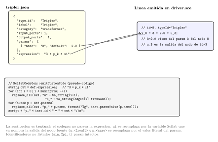
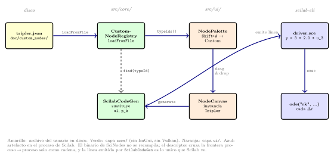

# Registry de nodos custom

`CustomNodeRegistry` (en `src/core/`) es el *hook* del editor
para definiciones de nodos cargadas en *runtime*. Vive en
paralelo al `nodeRegistry()` *built-in* del `NodeType.cpp`: la
gramática consulta ambos al validar, y el codegen sustituye la
`expression` del descriptor cuando emite el *script* Scilab.

## Diseño

El catálogo *built-in* está keyado por la enumeración cerrada
`enum class NodeType` y vive como una constante de compilación.
El registry custom está keyado por una `std::string typeId` y
vive como un objeto mutable en *runtime*:

```cpp
class CustomNodeRegistry {
public:
    bool loadFromJsonString(const std::string& json,
                            std::string* err = nullptr);
    bool loadFromFile(const std::string& path,
                      std::string* err = nullptr);

    const CustomNodeDef* find(const std::string& typeId) const;
    std::vector<std::string> typeIds() const;
    void clear();
};
```

No es un singleton: el acceso es por *service locator*. `AppWindow`
es dueño del *storage* (`m_customNodes`) y lo publica con
`installCustomNodes(reg)`; los consumidores
(`NodeInstance`, `NodeKind`, `ScilabCodeGen`, la paleta) resuelven
los tipos JSON con la función libre `customNodes()` —que devuelve el
registry instalado, o un *fallback* vacío durante el arranque muy
temprano—. `customNodesOpt()` da el puntero crudo (puede ser nulo).

`CustomNodeDef` carga lo mínimo para que la gramática y el
codegen puedan tratarlo igual que un nodo *built-in*:

```cpp
struct CustomNodeDef {
    std::string  typeId;        // clave única
    std::string  label;
    std::string  description;
    NodeCategory category;      // Source, Transformer, Sink
    int          inputPorts;
    int          outputPorts;
    std::vector<ParamDef> params;
    std::string  expression;    // Scilab expr, vacío para src/sink
};
```

## El archivo JSON

Cada descriptor en `doc/custom_nodes/` es un JSON con la
estructura documentada en
[Nodos personalizados](../user/custom-nodes.md). El loader es
permisivo respecto al orden de claves pero estricto respecto al
contenido:

- `type_id` no puede chocar con un *built-in* del enum
  `NodeType` ni con otro custom ya registrado.
- `category` se acepta como `"source" | "transformer" | "sink"`
  (string en minúsculas).
- `params[].name` debe ser un identificador C válido (la
  sustitución `p_<name>` lo usa como sufijo en el script).
- Si la carga falla, el registry queda sin tocar y `err`
  recibe el mensaje.

## Expression template

Para transformadores, la `expression` se interpreta como una
expresión Scilab con dos clases de placeholders:

- `u1`, `u2`, … — sustituidos por la expresión Scilab que
  produce cada puerto de entrada, en orden de cable.
- `p_<name>` — sustituido por el valor actual del parámetro
  con ese nombre.

La sustitución es por texto, sin parsing de Scilab: el codegen
hace un `replace_all` por cada placeholder. Es responsabilidad
del autor del descriptor escribir una expresión Scilab válida;
el editor no la pre-valida.



## Integración con grammar + codegen

Al cablear, `GrammarParser::validateEdge` consulta primero al
catálogo *built-in* y, si el tipo no está ahí, al
`CustomNodeRegistry`. Las reglas R0–R7 se aplican de la misma
manera; un custom se rechaza con el mismo `GrammarError` si
viola alguna.

En el codegen, `ScilabCodeGen` itera los nodos en orden
topológico y, cuando encuentra un nodo cuyo `type_id`
corresponde a un custom, busca la `expression` del descriptor,
sustituye los placeholders y emite la línea Scilab resultante.
La salida queda disponible para los cables aguas abajo igual
que cualquier salida *built-in*.



## Limitaciones de esta versión

- Sólo transformadores algebraicos. No hay forma de declarar
  estado propio en un custom; los nodos con estado siguen
  limitados al catálogo *built-in*.
- La carga es **bajo demanda desde la UI**, no al arrancar:
  `AppWindow` instala un registry inicialmente vacío, y el usuario
  carga descriptores con el diálogo *Load Custom…* (en
  `NodeCanvasPopups`), que llama `customNodes().loadFromFile(path)`.
  Los `.json` de ejemplo viven en `doc/custom_nodes/` (p. ej.
  `tripler.json`).
- `type_id` no se puede recargar: un descriptor con un `type_id` ya
  registrado se rechaza, así que para reflejar cambios en un `.json`
  ya cargado hay que `clear()` el registry (o reiniciar).

## `ScopedCustomNodes`: registro temporal

Para los tests (y para flujos donde un set custom solo debe estar
activo durante una operación), el header expone un wrapper RAII que
intercambia **cuál** registry resuelve `customNodes()`:

```cpp
class ScopedCustomNodes {
public:
    explicit ScopedCustomNodes(CustomNodeRegistry& reg);
    ~ScopedCustomNodes();  // restaura el registry instalado previamente
};
```

El constructor instala `reg` como el registry activo (guardando el
anterior); el destructor restaura el que estaba. No carga archivos
—eso lo hace el test sobre `reg` con `loadFromJsonString` /
`loadFromFile`—. Útil en tests que necesitan un set custom propio
sin contaminar el registry global del editor.

## Tests

`test_integration` ejerce el camino completo: un `ScopedCustomNodes`
enruta `customNodes()` a un registry fresco, se carga un descriptor
con `loadFromJsonString`, se instancia el nodo, se cablea, se lanza
`scilab-cli` y se verifica la salida contra el valor esperado con
tolerancia. `test_grammar` cubre por su parte la validación del
descriptor (JSON inválido, `type_id` duplicado, etc.). Si la
sustitución del *template* o la integración con el codegen se
rompen, los escenarios fallan.
