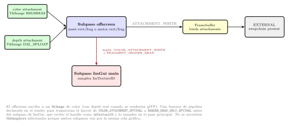
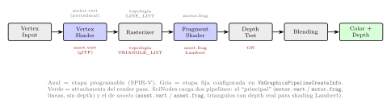
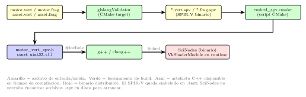
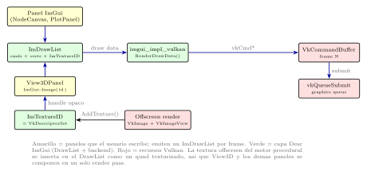

# Capa gráfica: Vulkan + ImGui

SciNodes dibuja con **Vulkan** como API de bajo nivel y **Dear ImGui**
como capa de interfaz. ImGui produce la UI (paneles, menús, el canvas de
nodos vía `ImDrawList`) y un motor procedural propio dibuja el visor 3-D;
ambos terminan en el mismo *command buffer* de Vulkan por frame.

## El render pass

Un único *render pass* con dos *attachments* —color y *depth*— organiza
el frame. El motor procedural y los *assets* glTF dibujan al *attachment*
de color (con *depth* real para los *assets*), y luego el color pasa a
`SHADER_READ` para que el subpaso de ImGui lo componga junto al resto de
la interfaz antes del *present*.

## Los dos pipelines gráficos

Sobre ese render pass conviven **dos** *pipelines* distintos:

- **principal** — dibuja los paneles de ImGui y el motor procedural
  (líneas); usa `motor.vert` / `motor.frag`, sin *depth buffer*.
- **assets** — dibuja la geometría glTF con *depth buffer* real y
  *shading* Lambert; usa `asset.vert` / `asset.frag`, conmutable entre
  *Wire* / *Solid* / *Both*.

## Shaders: el toolchain SPIR-V

Los *shaders* se compilan **en tiempo de build**, no en runtime: el
binario nunca busca `.spv` en disco. `glslangValidator` compila cada
`src/shaders/*.vert/frag` a un `.spv` binario; `embed_spv.cmake` lo
convierte en un header C++ con un `const uint32_t[]` embebido; y `g++`
lo enlaza al binario final.

## El puente ImGui ↔ Vulkan

ImGui no conoce Vulkan: produce una **lista de comandos de dibujo** por
frame. El backend `imgui_impl_vulkan` traduce esa lista a comandos Vulkan
dentro del *command buffer* del frame. El motor procedural del visor 3-D
(`View3DPanel`) dibuja a una **textura offscreen** que entra al *draw
list* como un `ImTextureID`, de modo que el 3-D se compone como un widget
más de la interfaz.

El renderer del canvas de nodos —que también usa `ImDrawList`— se
describe aparte en [Renderer nativo del canvas](native-renderer.md);
esta página cubre la capa gráfica que lo sostiene.
