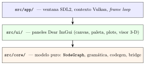

# Estructura del repositorio

```
SciNodes/
├── CMakeLists.txt           # CMake 3.25+, C++17, fetch SDL2/ImGui/imnodes/json
├── README.md
├── CHANGELOG.md
├── LICENSE                  # MIT
├── doc/
│   ├── db/                  # Tablas JSON: catálogo, reglas, menús, módulos…
│   └── manual/              # mdBook (usuario + desarrollador)
├── src/
│   ├── main.cpp             # entrypoint: instancia AppWindow y entra al frame loop
│   ├── app/                 # capa de aplicación
│   │   ├── AppWindow.{cpp,hpp}
│   │   ├── VulkanContext.{cpp,hpp}
│   │   └── FileDialog.{cpp,hpp}
│   ├── core/                # capa de modelo: sin SDL/Vulkan/ImGui
│   │   ├── NodeType.{cpp,hpp}
│   │   ├── NodeInstance.{cpp,hpp}
│   │   ├── Edge.hpp
│   │   ├── NodeGraph.{cpp,hpp}
│   │   ├── GrammarParser.{cpp,hpp}
│   │   ├── UndoRedoStack.{cpp,hpp}
│   │   ├── Fft.{cpp,hpp}             # radix-2 Cooley-Tukey para FFTAnalyzer
│   │   ├── ScilabCodeGen.{cpp,hpp}
│   │   ├── ScilabBridge.{cpp,hpp}    # incluye hilo dedicado del solver
│   │   └── ScnSerializer.{cpp,hpp}
│   └── ui/                  # capa de paneles (Dear ImGui + imnodes)
│       ├── NodeCanvas.{cpp,hpp}
│       ├── NodePalette.{cpp,hpp}
│       ├── PlotPanel.{cpp,hpp}
│       ├── View3DPanel.{cpp,hpp}
│       └── StatusBar.{cpp,hpp}
└── tests/
    ├── test_grammar.cpp     # 186 aserciones, sin Scilab
    └── test_integration.cpp # 171 aserciones, 14 escenarios con scilab-cli
```

## Las tres capas



La separación es estricta. `core/` no incluye headers de SDL,
Vulkan ni Dear ImGui. La suite `test_grammar` lo demuestra
construyendo grafos y ejerciendo R0–R5, alcanzabilidad y
undo/redo sin levantar ventana —186 aserciones en milisegundos—.

`ui/` consume `core/` y lo expone con Dear ImGui (rama `docking`)
e `imnodes`. Cada panel implementa su propio `draw()` que se
llama desde el *frame loop* del `AppWindow`. El estado vive en
`core/`; los paneles son ventanas sobre ese estado.

`app/` orquesta a las dos: instancia el `VulkanContext`, abre la
ventana SDL, dibuja la barra de menús (File, View, Help), recibe
las acciones de los paneles —en particular `SimAction` de la
`StatusBar`— y las despacha al subproceso de Scilab vía el
`ScilabBridge`.

## Dependencias del *build*

CMake descarga vía `FetchContent`, en orden: SDL2
(`release-2.30.2`, estática), Dear ImGui (rama `docking`),
imnodes (rama `master`) y nlohmann/json (`v3.11.3`,
*header-only*). Vulkan no se descarga: lo busca con
`find_package(Vulkan REQUIRED)` y debe estar instalado en el
sistema.

## Dependencias de *runtime*

Sólo una: **Scilab 2026** o más nuevo. El editor lanza
`scilab-cli` como subproceso al pulsar Run y la simulación se
delega completamente a ese hijo. SciNodes no incluye solucionador
propio.

## Documentación

`doc/db/` contiene las tablas JSON que describen las entidades
reales del código en este *tag*: el catálogo de nodos, las
reglas de gramática, los items de menú, los atajos, los módulos,
las dependencias, los controles de simulación, los escenarios de
prueba, el formato `.scn`, y la metadata del *tag* mismo. Cada
afirmación del manual (usuario y desarrollador) se apoya en esas
tablas. `doc/manual/` es el *mdBook* publicado.
