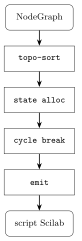
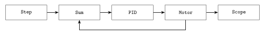

# Generación de código Scilab

`ScilabCodeGen` (en `src/core/`) traduce un `NodeGraph` válido a
un *script* Scilab autocontenido que define el vector de estado,
una función `dxdt(t, x)` y la integra con `ode("rk", ...)`. El
*script* generado se envía al subproceso `scilab-cli` al pulsar
Run.

## Pipeline



El flujo: el `NodeGraph` se ordena topológicamente respetando
dependencias de estado, se asignan *slots* a los nodos con
estado, se identifican y rompen ciclos usando esos nodos, y se
emite el preamble + el cuerpo de `dxdt` + la llamada a `ode` +
la extracción de las salidas observables.

## Stateless vs stateful

Cuando el grafo no tiene ningún nodo con estado, el código emitido
es directo —una función `y = run(t)` sin llamada a `ode`. Las
fuentes y los transformadores se concatenan en el orden topológico
y la salida se entrega a los sumideros:

```scilab
function y = run(t)
   y1 = sin(2*%pi*2*t);   // SineSignal
   y2 = 3 * y1;           // Gain
   // y2 → Oscilloscope
endfunction
```

Cuando hay nodos con estado —`Integrator`, `Differentiator`,
`LowPassFilter`, `PIDController`, `TransferFunction`,
`DCMotorModel`—, cada uno aporta uno o más *slots* al vector de
estado del grafo. El generador construye una función
`dxdt(t, x)` que calcula la derivada de cada *slot* en términos
del estado actual y las entradas externas, y la integra paso a
paso con `ode("rk", x, t_prev, t, dxdt)`:

```scilab
function dxdt = sys(t, x)
   y1 = step(t);          // StepSignal
   y2 = y1 - x(1);        // Summation: input − feedback
   dxdt(1) = y2;          // Integrator state derivative
endfunction

x0 = [0];
sol = ode("rk", x0, t0, [t0+dt], sys);
```

## *Cycle breaking* por estado puro

Cuando el grafo contiene un ciclo, el generador busca un nodo con
estado dentro del ciclo y lo usa como punto de ruptura. La
estrategia: el ciclo se topologiza ignorando las aristas que
entran al nodo con estado; en `dxdt`, la salida del nodo con
estado se calcula a partir de `x(slot)`, no de su entrada cruda
—esa entrada se usa para determinar `dxdt(slot)`, no `y(slot)`.

La semántica que esto da al lazo es que la salida observable en
tiempo `t` es el estado integrado hasta `t`. Para el usuario, lo
único visible es que un PID con realimentación del motor "se
comporta", sin tener que indicar manualmente qué nodo es el
romper.

Los ciclos *puramente combinacionales* —todos los nodos del
ciclo sin estado— no tienen un punto de ruptura natural. El
generador los rechaza con un mensaje al usuario; la gramática los
deja pasar como aviso porque la ambigüedad sólo se manifiesta al
codegenerar.

Un ejemplo típico que ejerce este mecanismo es el sexto escenario
de la suite de integración (`test_integration`):



Un `StepSignal` alimenta un `Summation` que combina la referencia
con la realimentación; la salida del sumador entra a un
`PIDController` cuya acción de control alimenta al `DCMotorModel`;
la velocidad del motor se observa en un `Oscilloscope` **y** se
realimenta al sumador. El motor es el nodo con estado dentro del
ciclo y el codegen lo usa como punto de ruptura. El test verifica
que el sistema converge al *setpoint* dentro del 5 % en 5 s.

## Nodos con estado y su contribución

Cada tipo de nodo con estado contribuye una EDO concreta a la
función `dxdt`:

- `Integrator`: `dxdt(slot) = entrada`. La salida del integrador
  es `x(slot)` directamente.
- `LowPassFilter` de primer orden con frecuencia de corte `fc`:
  `dxdt(slot) = 2π·fc·(entrada − x(slot))`. Salida: `x(slot)`.
- `Differentiator`: derivada filtrada
  `H(s) = s / (1 + s/wc)` que aporta un *slot* y se realiza vía
  `ode`. Sin el polo a `wc` la derivada pura es no causal y
  amplificaría el ruido.
- `PIDController`: parallel-form PID con anti-windup; aporta uno
  o dos *slots* (integral y, si `Kd > 0`, *filtered derivative*).
- `TransferFunction`: primer orden `H(s) = num[0] / (den[0] +
  den[1]·s)`. Aporta un *slot* y se integra con `ode`.
- `TransferFunction (2nd)`: segundo orden monico,
  `H(s) = (num[1]·s + num[0]) / (s² + den[1]·s + den[0])`.
  Aporta **dos *slots***: el codegen emite el sistema canónico
  controlable (`dxdt(1) = x(2)`, `dxdt(2) = u − den[0]·x(1) −
  den[1]·x(2)`) y compone la salida como
  `y = num[0]·x(1) + num[1]·x(2)`.
- `DCMotorModel`: motor DC simplificado con dinámica eléctrica y
  mecánica. Aporta **dos *slots*** —corriente del estator y
  velocidad angular— con EDOs acopladas vía `Ra`, `La`, `Ke`,
  `Kt`, `J`, `B`.

`InverseKinematics` no es un nodo con estado pero sí es
multi-output: el codegen lo trata como una función algebraica
con dos entradas `(x, y)` y dos salidas independientes
`(θ1, θ2)` calculadas vía la solución cerrada del IK planar
*elbow-up* (`c2 = (x²+y²−L1²−L2²)/(2L1L2)`, recortado a `|c2|≤1`).
Cada salida queda disponible para cablearse a un sumidero
distinto.

## Tests

`test_integration` ejerce el pipeline completo en 14 escenarios
*end-to-end*. Los seis originales (estable, *stateful*, EDO
acoplada, lazo de retroalimentación, *live tuning*, lazo cerrado
PID + planta + sum) ejercen los patrones canónicos del control.
Cuatro más aterrizan con la maduración del codegen:
`Differentiator` filtrado con entrada rampa, `TransferFunction`
de primer orden contra un escalón, `InverseKinematics` con
`(x,y)` en la frontera del workspace, y `TransferFunction (2nd)`
con polos en el eje imaginario para verificar oscilación no
amortiguada. Los cuatro últimos prueban las capacidades nuevas
del runtime: el hilo dedicado del solver llenando el buffer en
*background*, la detección de NaN por nodo con un polo en el
semiplano derecho, el camino completo desde Scilab al espectro
vía `Fft::magnitudeSpectrum`, y los buffers multi-canal que el
`PhasePortrait` consume desde dos sinusoides en cuadratura. Cada
escenario construye un grafo, deja que `ScilabCodeGen` emita el
*script*, lo manda a `scilab-cli` vía `ScilabBridge`, y verifica
la trayectoria contra valores esperados con tolerancia. 50
aserciones, todas pasan.
