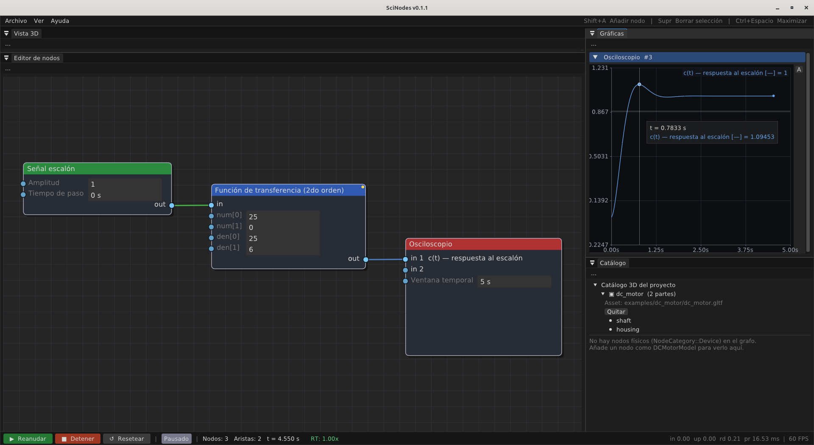
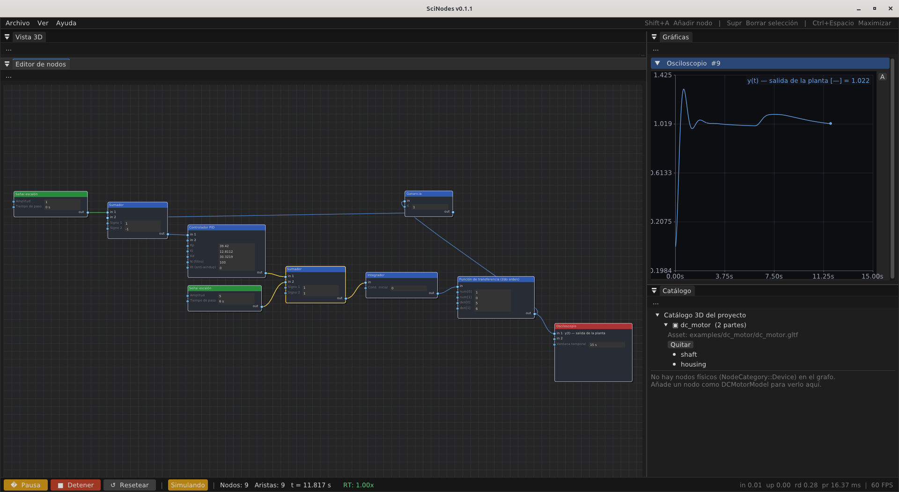
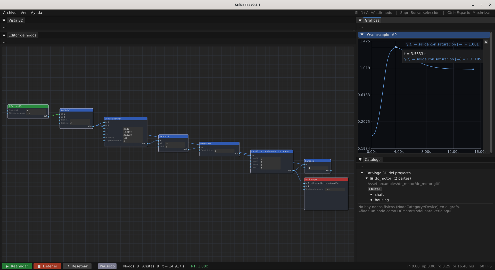
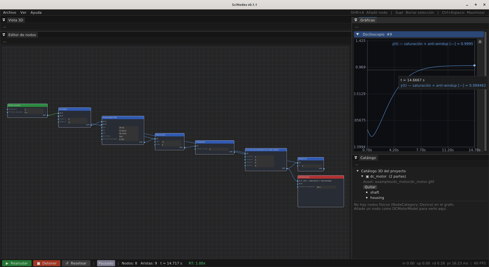
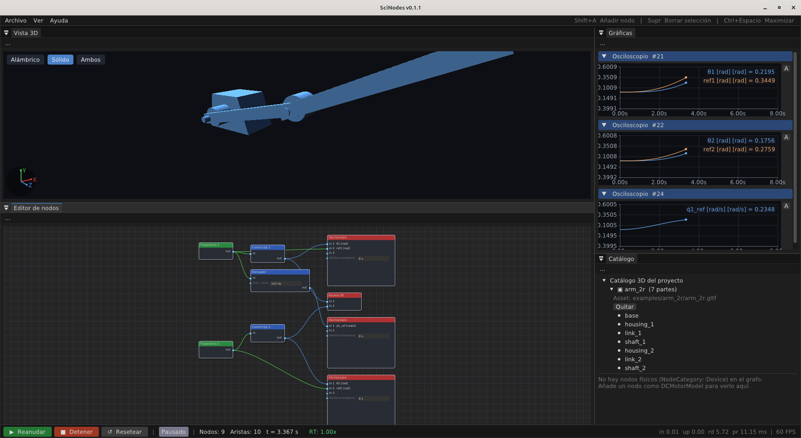
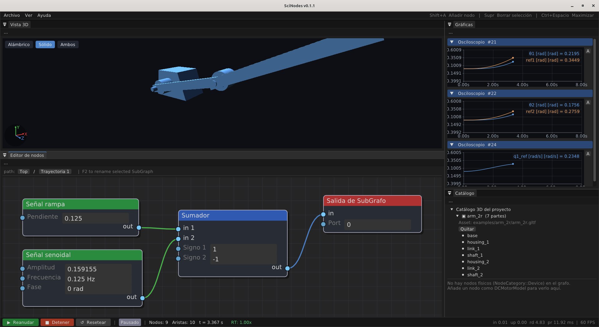
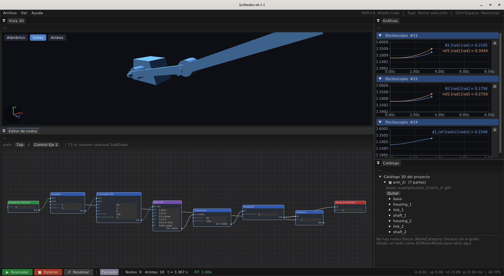
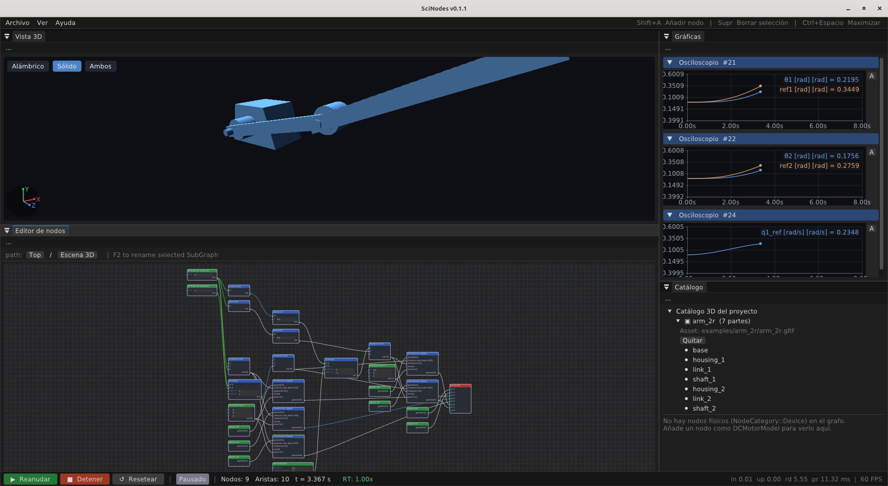

# Ejemplos guiados

Esta sección recorre los grafos de ejemplo del repo
(`examples/graphs/walkthrough_E*.scn`). Cada uno **reproduce un caso de
una referencia de la literatura** y sirve como tutorial de cómo armar ese
tipo de sistema en SciNodes.

Para cada ejemplo se describe **cómo construir el grafo** paso a paso y se
cierra con un **pantallazo del grafo terminado**. No hace falta armarlos a
mano para probarlos: todos se cargan listos desde **Ayuda → Ejemplos**.

> Convención: "añadir un nodo" es **Shift + A** sobre el canvas y elegir el
> tipo; los parámetros se editan inline en el cuerpo del nodo (ver
> [Uso básico](usage.md)); cablear es arrastrar de un puerto de salida a uno
> de entrada (ver [Cablear nodos](wiring.md)).

---

## E0 — Respuesta de un sistema de 2.º orden (Ogata §5-5)

**Qué demuestra:** la respuesta al escalón de un sistema de 2.º orden estándar
`C(s)/R(s) = 25/(s²+6s+25)` (ζ = 0.6, ωₙ = 5) y cómo **medir los parámetros
transitorios** —subida, pico, sobre-impulso, asentamiento— con el cursor del
osciloscopio. Es el ejemplo de **validación más fuerte** del set: reproduce
*exactos* los números que Ogata publica. Antes de cerrar un lazo con un PID
(E1), conviene entender la respuesta de la planta a lazo abierto.

**Cómo armarlo:**

1. **Step Signal** (`Amplitude = 1`, `Step Time = 0`).
2. **Transfer Function (2nd)** con `num = [25, 0]`, `den = [25, 6]` — o sea
   `25/(s²+6s+25)`.
3. **Oscilloscope** (`Time Window = 5`, igual que la Fig. 5-23 del libro).
4. Cableá `Step → Transfer Function (2nd) → Oscilloscope` y pulsá **Run**.
5. Con el cursor, leé sobre la curva: pico ≈ 1.0948 en `tₚ ≈ 0.785 s`
   (sobre-impulso ≈ 9.48 %), tiempo de subida ≈ 0.555 s, asentamiento al 2 %
   ≈ 1.185 s.

**Referencia:** K. Ogata, *Modern Control Engineering* 5e, §5-5
(Transient-Response Analysis), *Program 5-7* y Fig. 5-23. Los cuatro parámetros
están publicados ahí (calculados con `step()` de MATLAB, fuente independiente de
SciNodes) y SciNodes los reproduce clavados.

<figure>
  
  <figcaption>El grafo E0: la respuesta al escalón de <code>25/(s²+6s+25)</code> reproduce los parámetros transitorios publicados por Ogata (§5-5) — pico ≈ 1.0948 en tₚ ≈ 0.785 s (sobre-impulso ≈ 9.48 %).</figcaption>
</figure>

---

## E1 — Lazo PID de Ogata (Ejemplo 8-1)

**Qué demuestra:** un lazo cerrado PID sobre la planta canónica
`G(s) = 1/[s(s+1)(s+5)]`, reproduciendo la respuesta al escalón de Ogata,
Ec. (8-2). Es el ejemplo de control clásico de referencia.

**Cómo armarlo:**

1. Añadí un **Step Signal** (Amplitude = 1, Step Time = 0) — el *setpoint*.
2. Añadí un **Summation** y poné `Sign1 = +1`, `Sign2 = −1`: calcula el error
   `ref − realimentación`.
3. Añadí un **PID Controller** con `Kp = 39.42`, `Ki = 12.8112`,
   `Kd = 30.3219`, `N = 100` (los valores de Ogata Ec. 8-2).
4. Añadí un **Integrator** — es el factor `1/s` de la planta.
5. Añadí un **Transfer Function (2nd)** con `num = [1, 0]`, `den = [5, 6]`,
   o sea `1/(s²+6s+5) = 1/[(s+1)(s+5)]`. En serie con el integrador del paso 4
   da la planta completa `1/[s(s+1)(s+5)]`.
6. Añadí un **Oscilloscope** (Time Window = 14) y un **Gain** (`K = 1`) para la
   realimentación unitaria.
7. **Cableá** el lazo:
   `Step → Summation(in 0)`; `Summation → PID → Integrator → Transfer Function (2nd)`;
   `Transfer Function (2nd) → Oscilloscope`; `Transfer Function (2nd) → Gain`;
   `Gain → Summation(in 1)` (la realimentación que cierra el lazo).
8. Pulsá **Run**. La respuesta al escalón reproduce la Figura 8-10 del libro
   (≈ 28 % de sobre-impulso).

**Referencia:** K. Ogata, *Modern Control Engineering* 5e, Ejemplo 8-1,
Ec. (8-2).

<figure>
  
  <figcaption>El grafo E1 armado y corriendo: la respuesta al escalón del lazo cerrado reproduce la de Ogata (Fig. 8-10).</figcaption>
</figure>

---

## E1-DC — Lazo PID sobre un motor DC

**Qué demuestra:** el mismo lazo de control, pero sobre un **motor DC físico**
en lugar de la planta abstracta. La realimentación se cierra con un nodo
**Alias** para no cruzar el canvas con un cable largo.

**Cómo armarlo:**

1. **Step Signal** (Amplitude = 1) — la referencia de posición θ.
2. **Summation** (`Sign1 = +1`, `Sign2 = −1`).
3. **PID Controller** (`Kp = 2`, `Ki = 0.5`, `Kd = 1`, `N = 100`). En el cuerpo
   del nodo marcá las unidades de puerto: entrada `rad`, salida `V`.
4. **DC Motor Model** (`Ra = 1`, `La = 0.01`, `Ke = 0.1`, `Kt = 0.1`,
   `J = 0.01`, `B = 0.001`) — entrega la velocidad angular ω.
5. **Integrator** — convierte ω en posición θ.
6. **Oscilloscope** (Time Window = 5) y **Gain** (`K = 1`).
7. Añadí un **Alias** y apuntalo al `Gain` (campo *target*): es la
   realimentación virtual.
8. Cableá: `Step → Summation(in 0)`; `Summation → PID → DC Motor → Integrator →
   Oscilloscope`; `Integrator → Gain`; `Alias → Summation(in 1)`.
9. **Run** → θ converge a la referencia.

**Referencia:** modelo del motor: J. Melkebeek, *Electrical Machines and
Drives*, §26.1; estructura del lazo: Ogata, Ejemplo 8-1.

<figure>
  
  <figcaption>El grafo E1-DC: el mismo lazo de control sobre un motor DC, con la realimentación vía Alias para no cruzar el canvas.</figcaption>
</figure>

---

## E1-DC-3D — el mismo lazo con visor 3-D en vivo

**Qué demuestra:** el lazo de E1-DC **acoplado a la vista 3-D**: el eje del
motor gira en pantalla con la θ calculada.

**Cómo armarlo:**

1. Partí del grafo de **E1-DC** tal cual (lazo PID + motor + integrador, con la
   realimentación cerrada por el nodo **Alias**).
2. **Archivo → Importar modelo 3D** y cargá el `.gltf` del motor. Añadí dos
   nodos **Object 3D**: uno `housing`, otro `shaft`.
3. `Object3D(housing) → Scene Output` (queda estático).
4. Para el eje: **Combine XYZ** (arma un `vec(3)` de rotación; cableá la θ del
   `Integrator` a su componente Y) → **Transform Object** en el puerto de
   *rotación*; `Object3D(shaft) →` el puerto de *geometría* del Transform
   Object; `Transform Object → Scene Output`.
5. **Run** → el shaft gira dentro del housing siguiendo θ.

**Referencia:** numéricamente idéntico a E1-DC.

<figure>
  
  <figcaption>El grafo E1-DC-3D: el mismo lazo de E1-DC más el sub-grafo de escena que hace girar el eje del motor en el visor 3-D en tiempo real.</figcaption>
</figure>

---

## E2 — Rechazo de perturbación

**Qué demuestra:** el sistema de E1 sometido a una **perturbación de carga**;
el lazo la rechaza y vuelve al *setpoint*.

**Cómo armarlo:**

1. Partí del grafo de **E1**.
2. Insertá un segundo **Summation** (`Sign1 = +1`, `Sign2 = +1`) entre el PID y
   el Integrator: suma la señal de control + la perturbación.
3. Añadí un segundo **Step Signal** (`Amplitude = 5`, `Step Time = 6`) y
   cableá su salida a la entrada libre de ese Summation.
4. **Run** → a los 6 s entra el escalón; la salida se desvía y regresa al
   *setpoint*.

**Referencia:** Ogata, Ejemplo 8-1, Ec. (8-2).

<figure>
  
  <figcaption>El grafo E2: el sistema de E1 con un segundo escalón inyectado como perturbación de carga; el lazo la rechaza y la salida vuelve al <em>setpoint</em>.</figcaption>
</figure>

---

## E3 — Saturación del actuador e *integrator windup*

**Qué demuestra:** qué pasa cuando el actuador se **satura**: el integrador se
"embala" (*windup*) y la respuesta sobre-pasa muy por encima del *setpoint*
antes de recuperarse lentamente.

**Cómo armarlo:**

1. Partí del grafo de **E1**.
2. Insertá un **Saturation** (`Min = −5`, `Max = 5`) entre el **PID** y el
   **Integrator**.
3. **Run** → el escalón satura el actuador de inmediato (Kp ≈ 39); el
   integrador se embala y la salida sobre-pasa hasta ≈ 1.33 antes de bajar
   despacio al *setpoint*.

**Referencias:** el sistema es el de E1 (Ogata, Ec. (8-2)); el *integrator
windup* que aparece al saturar se describe en Åström & Hägglund, *Advanced PID
Control*, §3.5 — de forma cualitativa y gráfica (Figs. 3.11–3.12; el
*Example 3.2* es justo un cambio de *setpoint* grande que satura el actuador,
sin perturbación). Esa sección no trae un ejemplo numérico reproducible (ni
función de transferencia ni ganancias), así que de Åström se toma el concepto y
los números siguen siendo los de Ogata.

<figure>
  
  <figcaption>El grafo E3: el actuador se satura (±5) ante el escalón y el integrador se embala; la salida sobre-pasa hasta ≈1.33 antes de bajar lentamente al <em>setpoint</em>.</figcaption>
</figure>

---

## E3b — Anti-windup por *back-calculation*

**Qué demuestra:** la mitigación del windup de E3 con **anti-windup
back-calculation**.

**Cómo armarlo:**

1. Partí del grafo de **E3** (con la Saturation).
2. En el **PID Controller**, poné `Kt (anti-windup) = 0.325`.
3. Cableá la **salida del Saturation** también a la entrada de anti-windup del
   PID (`in 1`): el controlador "sabe" cuánto se saturó y descarga el
   integrador.
4. **Run** → comparado con E3, el sobre-impulso desaparece: la respuesta sube
   al *setpoint* casi sin pasarse (pico ≈ 1.0 en vez de ≈ 1.33).

**Referencias:** el sistema es el de E3 (Ogata, Ec. (8-2) + saturación); el
método de anti-windup (*back-calculation / tracking*) es Åström & Hägglund,
§3.5 (Fig. 3.13). De Åström se toma el método; los números son de Ogata.

<figure>
  
  <figcaption>El grafo E3b: con anti-windup <em>back-calculation</em> (la salida de la Saturación realimenta al PID, Kt=0.325) el sobre-impulso de E3 desaparece y la respuesta sube al <em>setpoint</em> casi sin pasarse.</figcaption>
</figure>

---

## E6 — Brazo 2R: trayectoria cicloidal y composición con SubGraphs

**Qué demuestra:** un manipulador planar de dos ejes que **sigue una trayectoria
suave** y se ve moverse en 3-D. Tres ideas a la vez:

- **Trayectoria planificada.** Cada junta sigue una curva *cicloidal* rest-to-rest
  (no un escalón): su velocidad arranca y termina en cero. Un escalón, en cambio,
  pediría aceleración infinita. El perfil es **verificable**: la velocidad llega a
  su pico `2·Δq/T` en la mitad del recorrido — la forma cerrada de Jazar.
- **Composición jerárquica.** El grafo se arma con **SubGraphs** reutilizables
  —`Trayectoria`, `Control Eje`, `Escena 3D`— cajas que agrupan lógica y dejan el
  nivel superior con sólo cinco cajas más los osciloscopios.
- **Visualización 3-D.** El brazo (`arm_2r.gltf`) se mueve en el panel Vista 3D;
  cada eslabón gira sobre el eje de su articulación.

**Cómo está armado** (se carga listo desde **Ayuda → Ejemplos**):

1. Por eje, un SubGraph **Trayectoria** genera la cicloidal
   `q(t) = qf·[t/T − sin(2πt/T)/2π]` con un `Ramp` menos un `Sine`
   (válida en `t ∈ [0, T]`).
2. Un SubGraph **Control Eje** (`PID → Motor DC → reductor → Integrator`, con
   realimentación) rastrea esa referencia y entrega la posición `θ`.
   (Hay **una `Trayectoria` y un `Control Eje` por junta** — dos instancias de
   cada uno; las trayectorias sólo difieren en el ángulo objetivo.)
3. Un SubGraph **Escena 3D** recibe `θ1, θ2` y encierra **toda** la
   representación: las cuentas de cinemática (los ángulos de giro Euler-Z y el
   desplazamiento del codo vivo `0.5·cosθ1, 0.5·sinθ1`), la geometría
   (`Object3D` por parte → `Transform Object`, cada eslabón girando sobre el eje
   de su *shaft* con el puerto **pivote**) y el `Scene Output`. Sólo entran `θ1`
   y `θ2`; al aplanar el SubGraph el visor 3-D encuentra la escena igual que si
   estuviera a nivel superior — la composición jerárquica es completa, sin que
   nada de la escena se "escape" hacia afuera. Ver [SubGraphs](subgraphs.md).
4. **Run** → el brazo recorre la trayectoria suavemente; los osciloscopios
   muestran `θ` siguiendo a la referencia y el perfil de velocidad cicloidal.

**Referencias:** trayectoria cicloidal — R. N. Jazar, *Theory of Applied
Robotics* 2e, §13.3 (Ej. 359); control de junta independiente — Spong, Hutchinson
& Vidyasagar, *Robot Modeling and Control*, Cap. 7; paradigma 2R — Jazar, Ej. 165.

**Pantallazos** — el grafo principal y el interior de cada **tipo** de SubGraph.
Hay dos `Trayectoria` y dos `Control Eje` (uno por junta), pero como las dos
instancias son idénticas —sólo cambia el ángulo objetivo de la trayectoria—
alcanza con mostrar una de cada (doble clic para entrar):

<figure>
  
  <figcaption>Grafo principal de E6: el nivel superior queda con cinco SubGraphs (dos <code>Trayectoria</code>, dos <code>Control Eje</code> y una <code>Escena 3D</code>) más la observación. El brazo se mueve en el visor 3-D y los osciloscopios muestran el seguimiento.</figcaption>
</figure>

<figure>
  
  <figcaption>Dentro de una <code>Trayectoria</code> (las dos son iguales, sólo cambia el ángulo objetivo): la cicloidal se arma como <code>Ramp − Sine</code>.</figcaption>
</figure>

<figure>
  
  <figcaption>Dentro de un <code>Control Eje</code> (los dos son iguales): el lazo <code>PID → Motor DC → reductor → Integrator</code> con realimentación directa rastrea la referencia.</figcaption>
</figure>

<figure>
  
  <figcaption>Dentro de la <code>Escena 3D</code>: la cinemática, la geometría (<code>Object3D → Transform Object</code>) y el <code>Scene Output</code> viven todos encapsulados; sólo entran θ1 y θ2.</figcaption>
</figure>

---

## E7 — Cinemática inversa de un brazo 2R

**Qué demuestra:** de un objetivo cartesiano `(x, y)` a los ángulos de junta
`(θ1, θ2)` de un brazo 2R, que alimentan los dos ejes de E6.

**Cómo armarlo:**

1. Dos **Step Signal**: `x = 0.3` y `y = 0.2` (el objetivo).
2. **Inverse Kinematics** (`Link 1 L = 0.3`, `Link 2 L = 0.2`). Tiene dos
   entradas `(x, y)` y dos salidas `(θ1, θ2)` en configuración *elbow-up*.
3. Cableá `x → Inverse Kinematics(in 0)`, `y → in 1`. Las salidas `θ1, θ2`
   alimentan los dos SubGraphs de ejes (como en E6) o un Terminal Display.
4. **Run** → para `(0.3, 0.2)` con esos brazos, la IK da `(θ1, θ2) = (0, π/2)`.

**Referencia:** R. N. Jazar, *Theory of Applied Robotics* 2e, Ejemplo 184
(cinemática inversa del 2R planar, *elbow-up*).

> 📷 _Pantallazo del grafo terminado: pendiente (`ex_E7.png`)._

---

## E9 — Red térmica del motor

**Qué demuestra:** el ciclo **termo-eléctrico**: el lazo de control más la red
térmica que calienta el bobinado del motor.

**Cómo armarlo:**

1. Armá un lazo de control con *setpoint* sinusoidal: **Sine Signal**
   (`Amplitude = π/2`, `Frequency = 0.2 Hz`) `→ Sum(+,−) → PID (Kp = 10,
   Ki = 1, Kd = 5) → DC Motor → Gear Transmission → Integrator →
   Oscilloscope(θ)`, con la realimentación cerrada por un nodo **Alias**
   (como en E1-DC).
2. **Rama térmica:** del `DC Motor`, cableá a un **Mechanical Loss**
   (pérdidas viscosa + arrastre) `→` **Thermal Mass** (`Thermal Capacitance =
   50`, `Thermal Resistance = 2`, `Ambient Temperature = 298.15`) `→` un
   segundo **Oscilloscope** (temperatura del motor).
3. *(Opcional)* Escena 3-D: como en E1-DC-3D (`Object 3D` housing/shaft +
   `Combine XYZ`(θ) → `Transform Object` → `Scene Output`).
4. **Run** 30 s → el motor sigue el *setpoint* sinusoidal y la temperatura
   sube hacia su régimen.

**Referencia:** M. Roşu et al., *Multiphysics Simulation by Design…*, §4.6
(Thermal Network Based on Lumped Parameters).

> 📷 _Pantallazo del grafo terminado: pendiente (`ex_E9.png`)._
