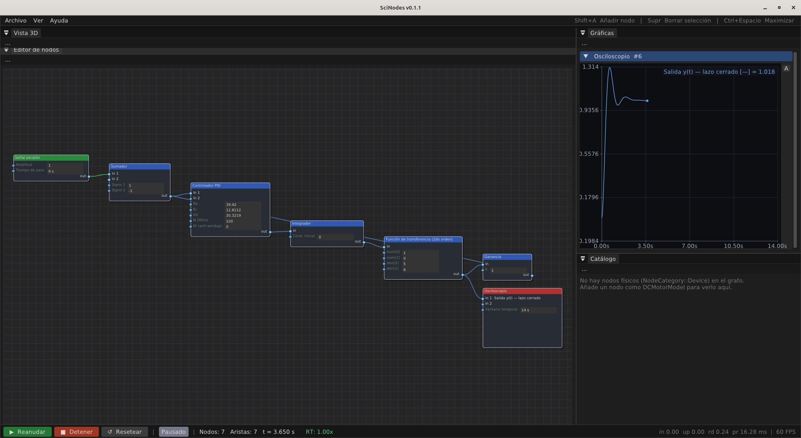
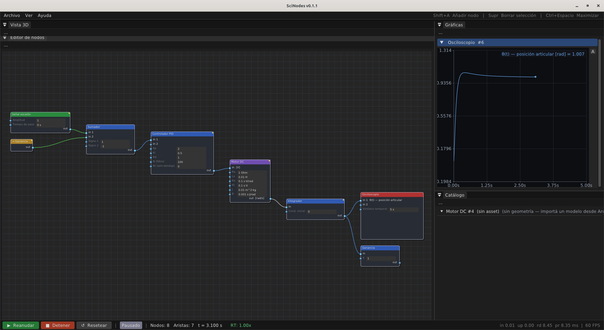
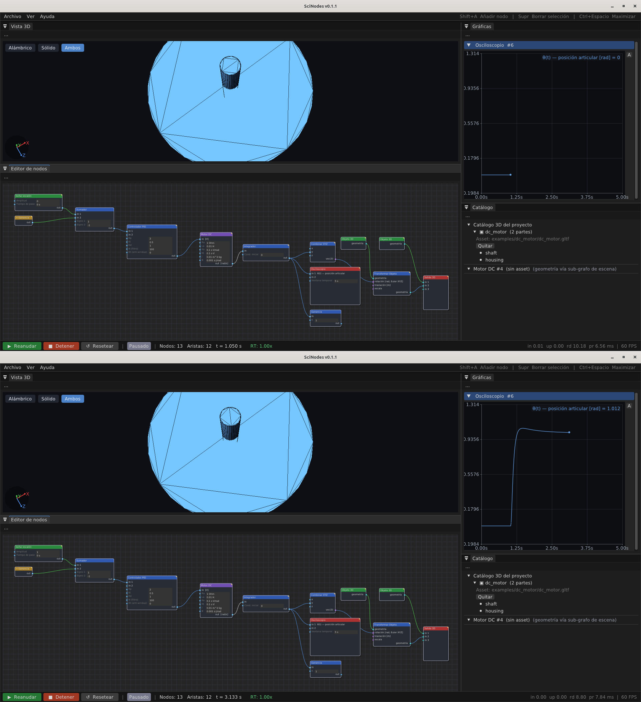

# Ejemplos guiados

Esta sección recorre los grafos de ejemplo del repo
(`examples/graphs/walkthrough_E*.scn`). Cada uno **reproduce un caso de
una referencia de la literatura** y sirve como tutorial de cómo armar ese
tipo de sistema en SciNodes.

Para cada ejemplo se describe **cómo construir el grafo** paso a paso y se
cierra con un **pantallazo del grafo terminado**. No hace falta armarlos a
mano para probarlos: todos se cargan listos desde **Ayuda → Ejemplos**.

> Convención: "añadir un nodo" es **Shift + A** sobre el canvas y elegir el
> tipo; los parámetros se editan inline en el cuerpo del nodo (ver
> [Uso básico](usage.md)); cablear es arrastrar de un puerto de salida a uno
> de entrada (ver [Cablear nodos](wiring.md)).

---

## E1 — Lazo PID de Ogata (Ejemplo 8-1)

**Qué demuestra:** un lazo cerrado PID sobre la planta canónica
`G(s) = 1/[s(s+1)(s+5)]`, reproduciendo la respuesta al escalón de Ogata,
Ec. (8-2). Es el ejemplo de control clásico de referencia.

**Cómo armarlo:**

1. Añadí un **Step Signal** (Amplitude = 1, Step Time = 0) — el *setpoint*.
2. Añadí un **Summation** y poné `Sign1 = +1`, `Sign2 = −1`: calcula el error
   `ref − realimentación`.
3. Añadí un **PID Controller** con `Kp = 39.42`, `Ki = 12.8112`,
   `Kd = 30.3219`, `N = 100` (los valores de Ogata Ec. 8-2).
4. Añadí un **Integrator** — es el factor `1/s` de la planta.
5. Añadí un **Transfer Function (2nd)** con `num = [1, 0]`, `den = [5, 6]`,
   o sea `1/(s²+6s+5) = 1/[(s+1)(s+5)]`. En serie con el integrador del paso 4
   da la planta completa `1/[s(s+1)(s+5)]`.
6. Añadí un **Oscilloscope** (Time Window = 14) y un **Gain** (`K = 1`) para la
   realimentación unitaria.
7. **Cableá** el lazo:
   `Step → Summation(in 0)`; `Summation → PID → Integrator → Transfer Function (2nd)`;
   `Transfer Function (2nd) → Oscilloscope`; `Transfer Function (2nd) → Gain`;
   `Gain → Summation(in 1)` (la realimentación que cierra el lazo).
8. Pulsá **Run**. La respuesta al escalón reproduce la Figura 8-10 del libro
   (≈ 28 % de sobre-impulso).

**Referencia:** K. Ogata, *Modern Control Engineering* 5e, Ejemplo 8-1,
Ec. (8-2).

<figure>
  
  <figcaption>El grafo E1 armado y corriendo: la respuesta al escalón del lazo cerrado reproduce la de Ogata (Fig. 8-10).</figcaption>
</figure>

---

## E1-DC — Lazo PID sobre un motor DC

**Qué demuestra:** el mismo lazo de control, pero sobre un **motor DC físico**
en lugar de la planta abstracta. La realimentación se cierra con un nodo
**Alias** para no cruzar el canvas con un cable largo.

**Cómo armarlo:**

1. **Step Signal** (Amplitude = 1) — la referencia de posición θ.
2. **Summation** (`Sign1 = +1`, `Sign2 = −1`).
3. **PID Controller** (`Kp = 2`, `Ki = 0.5`, `Kd = 1`, `N = 100`). En el cuerpo
   del nodo marcá las unidades de puerto: entrada `rad`, salida `V`.
4. **DC Motor Model** (`Ra = 1`, `La = 0.01`, `Ke = 0.1`, `Kt = 0.1`,
   `J = 0.01`, `B = 0.001`) — entrega la velocidad angular ω.
5. **Integrator** — convierte ω en posición θ.
6. **Oscilloscope** (Time Window = 5) y **Gain** (`K = 1`).
7. Añadí un **Alias** y apuntalo al `Gain` (campo *target*): es la
   realimentación virtual.
8. Cableá: `Step → Summation(in 0)`; `Summation → PID → DC Motor → Integrator →
   Oscilloscope`; `Integrator → Gain`; `Alias → Summation(in 1)`.
9. **Run** → θ converge a la referencia.

**Referencia:** modelo del motor: J. Melkebeek, *Electrical Machines and
Drives*, §26.1; estructura del lazo: Ogata, Ejemplo 8-1.

<figure>
  
  <figcaption>El grafo E1-DC: el mismo lazo de control sobre un motor DC, con la realimentación vía Alias para no cruzar el canvas.</figcaption>
</figure>

---

## E1-DC-3D — el mismo lazo con visor 3-D en vivo

**Qué demuestra:** el lazo de E1-DC **acoplado a la vista 3-D**: el eje del
motor gira en pantalla con la θ calculada.

**Cómo armarlo:**

1. Partí del grafo de **E1-DC** tal cual (lazo PID + motor + integrador, con la
   realimentación cerrada por el nodo **Alias**).
2. **Archivo → Importar modelo 3D** y cargá el `.gltf` del motor. Añadí dos
   nodos **Object 3D**: uno `housing`, otro `shaft`.
3. `Object3D(housing) → Scene Output` (queda estático).
4. Para el eje: **Combine XYZ** (arma un `vec(3)` de rotación; cableá la θ del
   `Integrator` a su componente Y) → **Transform Object** en el puerto de
   *rotación*; `Object3D(shaft) →` el puerto de *geometría* del Transform
   Object; `Transform Object → Scene Output`.
5. **Run** → el shaft gira dentro del housing siguiendo θ.

**Referencia:** numéricamente idéntico a E1-DC.

<figure>
  
  <figcaption>El grafo E1-DC-3D: el mismo lazo de E1-DC más el sub-grafo de escena que hace girar el eje del motor en el visor 3-D en tiempo real.</figcaption>
</figure>

---

## E2 — Rechazo de perturbación

**Qué demuestra:** el sistema de E1 sometido a una **perturbación de carga**;
el lazo la rechaza y vuelve al *setpoint*.

**Cómo armarlo:**

1. Partí del grafo de **E1**.
2. Insertá un segundo **Summation** (`Sign1 = +1`, `Sign2 = +1`) entre el PID y
   el Integrator: suma la señal de control + la perturbación.
3. Añadí un segundo **Step Signal** (`Amplitude = 5`, `Step Time = 6`) y
   cableá su salida a la entrada libre de ese Summation.
4. **Run** → a los 6 s entra el escalón; la salida se desvía y regresa al
   *setpoint*.

**Referencia:** Ogata, Ejemplo 8-1, Ec. (8-2).

> 📷 _Pantallazo del grafo terminado: pendiente (`ex_E2.png`)._

---

## E3 — Saturación del actuador e *integrator windup*

**Qué demuestra:** qué pasa cuando el actuador se **satura** sin remedio: el
integrador se "embala" (*windup*) y la respuesta queda atrapada.

**Cómo armarlo:**

1. Partí del grafo de **E2** (lazo + perturbación).
2. Insertá un **Saturation** (`Min = −5`, `Max = 5`) entre el PID y el
   Summation de la perturbación.
3. **Run** → tras la perturbación, el sobre-impulso se prolonga por el windup.

**Referencias:** el sistema es el de E1/E2 (Ogata, Ec. (8-2)); el *integrator
windup* que aparece al saturar se describe en Åström & Hägglund, *Advanced PID
Control*, §3.5 — cualitativamente (su ejemplo numérico usa otra planta).

> 📷 _Pantallazo del grafo terminado: pendiente (`ex_E3.png`)._

---

## E3b — Anti-windup por *back-calculation*

**Qué demuestra:** la mitigación del windup de E3 con **anti-windup
back-calculation**.

**Cómo armarlo:**

1. Partí del grafo de **E3** (con la Saturation).
2. En el **PID Controller**, poné `Kt (anti-windup) = 0.325`.
3. Cableá la **salida del Saturation** también a la entrada de anti-windup del
   PID (`in 1`): el controlador "sabe" cuánto se saturó y descarga el
   integrador.
4. **Run** → comparado con E3, la respuesta deja de quedar atrapada.

**Referencias:** el sistema es el de E3 (Ogata, Ec. (8-2) + saturación); el
método de anti-windup (*back-calculation / tracking*) es Åström & Hägglund,
§3.5 (Fig. 3.13). De Åström se toma el método; los números son de Ogata.

> 📷 _Pantallazo del grafo terminado: pendiente (`ex_E3b.png`)._

---

## E4 — Control de posición de un motor DC

**Qué demuestra:** control de posición del motor DC a un *setpoint* de
`π/2 rad`.

**Cómo armarlo:**

1. **Step Signal** (`Amplitude = 1.5708`, o sea π/2).
2. **Summation** (`+`, `−`); **PID Controller** (`Kp = 2`, `Ki = 0.5`,
   `Kd = 1`, `N = 100`); **DC Motor Model** (`Ra = 1`, `La = 0.01`,
   `Ke = Kt = 0.1`, `J = 0.01`, `B = 0.001`); **Integrator** (ω→θ);
   **Oscilloscope**; **Gain** (`K = 1`).
3. Cableá: `Step → Sum → PID → Motor → Integrator → Oscilloscope`;
   `Integrator → Gain`; y cerrá la realimentación con un nodo **Alias**
   apuntando al `Gain` (como en E1-DC, para no cruzar el canvas).
4. **Run** → θ converge a π/2.

**Referencia:** modelo del motor: Melkebeek, *Electrical Machines and Drives*,
§26.1.

> 📷 _Pantallazo del grafo terminado: pendiente (`ex_E4.png`)._

---

## E5 — Control de posición con reductor

**Qué demuestra:** control de posición del motor DC **a través de un reductor**
(Gear Transmission, 50:1); el reductor cambia la dinámica que ve el lazo
respecto a E4.

**Cómo armarlo:**

1. Partí del grafo de **E4** (lazo PID + motor + integrador, *setpoint* π/2).
2. Insertá un **Gear Transmission** (`Ratio = 50`, `Efficiency = 0.95`) entre el
   `DC Motor` y el `Integrator`.
3. Ajustá la sintonía del PID a `Kp = 10`, `Ki = 1`, `Kd = 5` (un diseño propio
   conservador para esta planta con reductor).
4. **Run** → θ converge al *setpoint* con la dinámica del conjunto motor +
   reductor.

**Referencia:** modelo del motor: Melkebeek, §26.1; control PID: Ogata, Cap. 8.
La sintonía es un diseño propio.

> 📷 _Pantallazo del grafo terminado: pendiente (`ex_E5.png`)._

---

## E6 — Brazo 2R: dos ejes con SubGraph

**Qué demuestra:** **composición jerárquica** — el lazo de control de un eje,
encapsulado como SubGraph reutilizable e instanciado dos veces (control
independiente por junta).

**Cómo armarlo:**

1. Armá el lazo de control de un eje: `Step → Sum(+,−) → PID → DC Motor →
   Gear Transmission (Ratio = 50, Efficiency = 0.95) → Integrator → salida`,
   con realimentación al Summation.
2. Seleccioná el lazo (sin el Step ni el Oscilloscope) y encapsulalo con
   **Ctrl+G**: queda un **SubGraph** con un puerto de entrada (*setpoint*) y
   uno de salida (posición). Ver [SubGraphs](subgraphs.md).
3. Duplicá el SubGraph para el segundo eje (`Ctrl+C` / `Ctrl+V`).
4. Añadí dos **Step Signal** con *setpoints* distintos (π/2 y π/3), cableá uno
   a cada SubGraph, y las dos salidas a un **Oscilloscope**.
5. **Run** → cada eje sigue su *setpoint* de forma independiente.

**Referencia:** Spong, Hutchinson & Vidyasagar, *Robot Modeling and Control*,
Cap. 7 (Independent Joint Control); R. N. Jazar, *Theory of Applied Robotics*
2e, Ej. 165.

> 📷 _Pantallazo del grafo terminado: pendiente (`ex_E6.png`)._

---

## E7 — Cinemática inversa de un brazo 2R

**Qué demuestra:** de un objetivo cartesiano `(x, y)` a los ángulos de junta
`(θ1, θ2)` de un brazo 2R, que alimentan los dos ejes de E6.

**Cómo armarlo:**

1. Dos **Step Signal**: `x = 0.3` y `y = 0.2` (el objetivo).
2. **Inverse Kinematics** (`Link 1 L = 0.3`, `Link 2 L = 0.2`). Tiene dos
   entradas `(x, y)` y dos salidas `(θ1, θ2)` en configuración *elbow-up*.
3. Cableá `x → Inverse Kinematics(in 0)`, `y → in 1`. Las salidas `θ1, θ2`
   alimentan los dos SubGraphs de ejes (como en E6) o un Terminal Display.
4. **Run** → para `(0.3, 0.2)` con esos brazos, la IK da `(θ1, θ2) = (0, π/2)`.

**Referencia:** R. N. Jazar, *Theory of Applied Robotics* 2e, Ejemplo 184
(cinemática inversa del 2R planar, *elbow-up*).

> 📷 _Pantallazo del grafo terminado: pendiente (`ex_E7.png`)._

---

## E9 — Red térmica del motor

**Qué demuestra:** el ciclo **termo-eléctrico**: el lazo de control más la red
térmica que calienta el bobinado del motor.

**Cómo armarlo:**

1. Armá un lazo de control con *setpoint* sinusoidal: **Sine Signal**
   (`Amplitude = π/2`, `Frequency = 0.2 Hz`) `→ Sum(+,−) → PID (Kp = 10,
   Ki = 1, Kd = 5) → DC Motor → Gear Transmission → Integrator →
   Oscilloscope(θ)`, con la realimentación cerrada por un nodo **Alias**
   (como en E1-DC).
2. **Rama térmica:** del `DC Motor`, cableá a un **Mechanical Loss**
   (pérdidas viscosa + arrastre) `→` **Thermal Mass** (`Thermal Capacitance =
   50`, `Thermal Resistance = 2`, `Ambient Temperature = 298.15`) `→` un
   segundo **Oscilloscope** (temperatura del motor).
3. *(Opcional)* Escena 3-D: como en E1-DC-3D (`Object 3D` housing/shaft +
   `Combine XYZ`(θ) → `Transform Object` → `Scene Output`).
4. **Run** 30 s → el motor sigue el *setpoint* sinusoidal y la temperatura
   sube hacia su régimen.

**Referencia:** M. Roşu et al., *Multiphysics Simulation by Design…*, §4.6
(Thermal Network Based on Lumped Parameters).

> 📷 _Pantallazo del grafo terminado: pendiente (`ex_E9.png`)._
