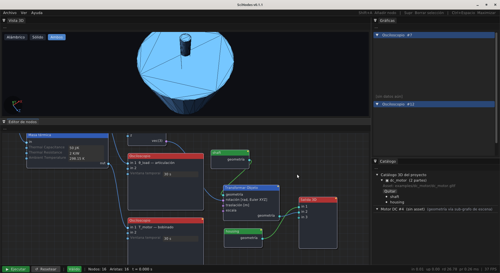

# Outliner — catálogo de dispositivos 3D

<figure>
   dc_motor (2 partes)' expandido con 'shaft' y 'housing' como bullets; debajo 'Motor DC #4 (sin asset) (geometría vía sub-grafo de escena)'. A la izquierda el sub-grafo de escena del ejemplo E9 con Object3D + TransformObject + SceneOutput." />
  <figcaption>Outliner mostrando el catálogo <code>objects</code> del proyecto (PATH B) y un Device referenciándolo vía sub-grafo de escena.</figcaption>
</figure>

El **Outliner** es el panel jerárquico que muestra los
dispositivos físicos del grafo activo junto con sus assets 3D
asociados.  Es lectura + acciones específicas; NO es un
navegador del grafo (eso lo cubre la búsqueda
<kbd>Shift</kbd>+<kbd>B</kbd>).

## Qué muestra

Por cada nodo de **categoría Device** del grafo (ej.
`DCMotorModel`, `PMSMElectromagnetic`, etc.), una entrada con:

- Nombre del dispositivo (el del nodo en el canvas).
- Asset 3D asignado (path al `.gltf` / `.glb`), si tiene.
- Partes del modelo (sub-meshes, joints, anchors) si el asset
  declara una estructura.

Ejemplo de árbol típico:

```
■ DCMotor #4
  ├─ shaft        (mesh)
  ├─ housing      (mesh)
  └─ flange       (anchor)
■ PMSM #8
  └─ rotor        (mesh)
```

## Qué se puede hacer

| Acción                                          | Efecto                                       |
|-------------------------------------------------|----------------------------------------------|
| Click en una entrada                            | Selecciona el nodo Device correspondiente en el canvas. |
| Botón **🔄 reload** al lado del path            | Recarga el asset desde disco — útil si re-exportaste el `.gltf` desde Blender. |
| Botón **× unlink**                              | Desvincula el asset del Device (el modelo queda con la geometría procedural por defecto). |

> Doble-click en el path abre el diálogo `AssetMappingPanel`
> para asociar un asset distinto o configurar el mapeo
> de partes.

## Qué NO se puede hacer desde el Outliner

- Editar el nombre del Device (eso es <kbd>F2</kbd> sobre el
  nodo en el canvas).
- Editar parámetros del Device (eso es el panel inline en el
  canvas).
- Navegar a sub-grafos (eso es doble-click en el canvas).
- Buscar nodos no-Device (eso es <kbd>Shift</kbd>+<kbd>B</kbd>).

## Cuándo aparece

El Outliner se muestra solamente si hay al menos **un Device**
en el grafo activo.  En un grafo de control puro (sin dinámica
3D) el panel queda vacío o oculto, según tu layout de docking.
