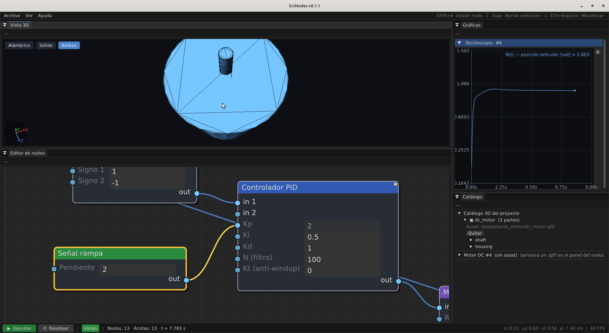

# Per-param pins: cablear parámetros

<figure>
  
  <figcaption>Pin del parámetro <code>Kp</code> del PID cableado a una <code>Señal rampa</code> — el widget se atenúa porque su valor literal ya no manda.</figcaption>
</figure>

A partir de v0.0.8 cada parámetro de cada nodo gana un puerto
visual a la izquierda de su widget. Si dejas el puerto sin
cablear, el valor del widget rige como siempre. Si conectas un
*signal* al pin del param, **la señal entrante reemplaza el
valor del widget** en cada paso del solver.

Es la herramienta canónica para barrer un parámetro
dinámicamente, alimentar una ganancia desde otro nodo, o
construir compensadores adaptativos sin tener que escribir un
nodo nuevo.

## Cómo cablear un param

1. Encuentra el pin del parámetro en el cuerpo del nodo, a la
   izquierda del widget (`Kp`, `K`, `Time Constant`, ...).
2. Arrastra desde la salida de otro nodo hasta ese pin.
3. El widget queda atenuado en gris: su valor literal ya no
   se usa para esa instancia.

Para desconectar, arrastra el extremo del cable lejos del pin
o borra el cable con `Backspace` mientras lo seleccionas.

## Reglas que aplican

La gramática trata el pin de un parámetro igual que cualquier
otro pin de entrada:

- **R3 (no self-loops):** la salida de un nodo no puede entrar
  a un pin de uno de sus propios parámetros.
- **R5 (un edge por pin de entrada):** sólo un cable puede
  llegar a cada pin de param. Si quieres sumar dos señales,
  pones un `Summation` antes.

Una violación se reporta con el mismo mecanismo que las demás: el
cable simplemente **no se crea** y la barra de estado muestra el
código de la regla y el mensaje durante unos segundos.

## Persistencia: `.scn`

Cada arista al pin de un parámetro se serializa codificando el
índice del param dentro del atributo destino. El loader
reconstruye el edge sobre el pin correcto al recargar el
archivo. La compatibilidad hacia atrás se mantiene: los `.scn`
viejos no llevaban cables a pins de param y siguen cargando
limpio.

## Casos típicos

- **Barrido en vivo de Kp:** `Ramp Signal → PIDController.Kp`
  para mover Kp linealmente durante una corrida y ver el
  comportamiento del lazo cerrado mientras Kp cambia.
- **Ganancia controlada por temperatura:**
  `ThermalMass → Gain.K` para que la ganancia dependa de la
  temperatura del bobinado.
- **Compensador adaptativo:** un nodo de control superior
  computa Kp/Ki/Kd óptimos y los entrega al PIDController vía
  los pines de sus tres ganancias.

El widget atenuado conserva su valor en memoria, así que si
desconectas el cable, el param vuelve al valor que tenía antes
de cablearlo. No hay sorpresas.
