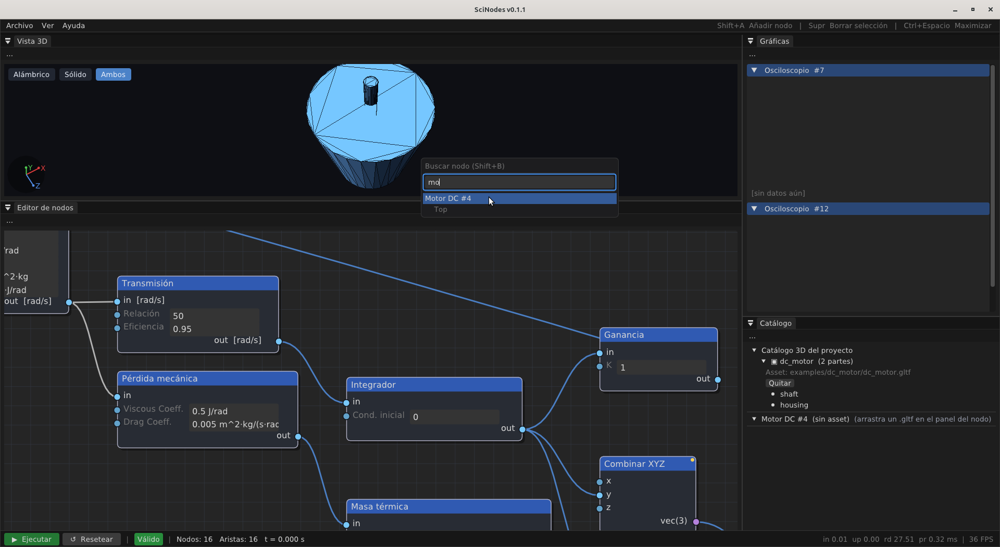

# Atajos de teclado

Resumen de atajos verificados contra el código (`src/ui/`).
Si tu build se comporta distinto, es un bug — reportá en GitHub.

## Canvas — creación de nodos

| Atajo                              | Acción                                            |
|------------------------------------|---------------------------------------------------|
| <kbd>Shift</kbd>+<kbd>A</kbd>      | Abrir popup de creación de nodos en el cursor.   |
| **Drag desde un pin OUT → soltar al vacío** | Popup con auto-connect.  Crea el nodo nuevo cableado al pin de origen.  Si elegís un nodo existente del canvas (sección "Nodos en el canvas"), se crea un **edge directo** al input elegido — sin Alias porque el destino ya existe. |
| **Drag desde un pin IN → soltar al vacío**  | Popup con auto-connect inverso.  Crea el nodo nuevo cableado a este input.  Si elegís un nodo existente, se crea un **Alias** apuntando al output elegido — el cable se ve corto y el nodo Alias actúa como atajo visual sin cruzar el canvas. |
| Click-derecho sobre un cable        | Popup "insertar nodo entre" — el nodo elegido se cablea entre los dos extremos del cable original. |

## Canvas — edición

| Atajo                              | Acción                                            |
|------------------------------------|---------------------------------------------------|
| <kbd>Ctrl</kbd>+<kbd>G</kbd>       | Encapsular selección en SubGraph.                |
| <kbd>Ctrl</kbd>+<kbd>L</kbd>       | Auto-layout BFS del grafo activo.                |
| <kbd>Doble-click</kbd> SubGraph    | Entrar al sub-grafo.                              |
| <kbd>Esc</kbd>                     | Salir del sub-grafo / cerrar popup activo.       |
| <kbd>Ctrl</kbd>+<kbd>Z</kbd>       | Deshacer.                                          |
| <kbd>Ctrl</kbd>+<kbd>Y</kbd> ó <kbd>Ctrl</kbd>+<kbd>Shift</kbd>+<kbd>Z</kbd> | Rehacer. |
| <kbd>Ctrl</kbd>+<kbd>C</kbd>       | Copiar selección.                                  |
| <kbd>Ctrl</kbd>+<kbd>V</kbd>       | Pegar.                                             |
| <kbd>Delete</kbd> ó <kbd>Backspace</kbd> | Borrar selección.                            |
| <kbd>F2</kbd>                      | Editar **Name** y **Comment** del nodo seleccionado.  El comment aparece como tooltip al hover. |

## Cámara

| Atajo                              | Acción                                            |
|------------------------------------|---------------------------------------------------|
| Middle-click + drag                 | Pan del canvas.                                   |
| Scroll                              | Zoom centrado en cursor.                          |
| <kbd>C</kbd>                       | Centrar cámara en nodo seleccionado (sin cambiar zoom). |
| <kbd>E</kbd>                       | Encuadrar nodo seleccionado (zoom adaptativo, máx 1.5×). |
| <kbd>F</kbd> ó <kbd>Home</kbd>     | Encuadrar todo el grafo.                          |

## Búsqueda

<figure>
  
  <figcaption>Popup <kbd>Shift+B</kbd> buscando "mo" sobre el ejemplo E9 — match único <code>Motor DC #4</code> con breadcrumb del path.</figcaption>
</figure>

| Atajo                              | Acción                                            |
|------------------------------------|---------------------------------------------------|
| <kbd>Shift</kbd>+<kbd>B</kbd>      | Buscar nodo por nombre — recursivo en todos los sub-grafos. |

Dentro del popup de búsqueda:

| Tecla                              | Acción                                            |
|------------------------------------|---------------------------------------------------|
| <kbd>Enter</kbd>                   | Ir al resultado seleccionado.                    |
| <kbd>C</kbd> sobre un resultado    | Centrar cámara en el nodo (sin tocar zoom).      |
| <kbd>E</kbd> sobre un resultado    | Encuadrar el nodo (zoom adaptativo).             |
| <kbd>Esc</kbd>                     | Cerrar el popup sin navegar.                     |

> El search match es **case-insensitive substring** contra el
> nombre custom del nodo (si fue editado con F2) o el label
> traducido por defecto.  Funciona en cualquier idioma cargado.

## Workspace

| Atajo                              | Acción                                            |
|------------------------------------|---------------------------------------------------|
| <kbd>Ctrl</kbd>+<kbd>Space</kbd>   | Maximizar el Area bajo el cursor al viewport completo (el menubar global queda visible).  Volver a pulsar restaura el layout dockeado. |

> La maximización es **transitoria por sesión** — no se persiste
> en `imgui.ini`, así que la app siempre arranca con todas las
> Areas visibles.  Útil para capturas y para ver simulaciones
> donde el plot o la Vista 3D necesitan toda la pantalla.

## Archivos (vía menú)

Estos atajos aparecen al lado de la entrada en el menú **Archivo**:

| Atajo                              | Acción                                            |
|------------------------------------|---------------------------------------------------|
| <kbd>Ctrl</kbd>+<kbd>N</kbd>       | Nuevo grafo (descarta el actual).                |
| <kbd>Ctrl</kbd>+<kbd>O</kbd>       | Abrir `.scn`.                                     |
| <kbd>Ctrl</kbd>+<kbd>S</kbd>       | Guardar.                                           |
| <kbd>Ctrl</kbd>+<kbd>Shift</kbd>+<kbd>S</kbd> | Guardar como.                              |
| <kbd>Alt</kbd>+<kbd>F4</kbd>       | Salir (default del sistema operativo).            |

> Importar (`Archivo → Importar`), Importar modelo 3D y
> Exportar (`Archivo → Exportar → CSV…` / `SOD`) no
> tienen atajo dedicado — están en el menú.

## Simulación

La simulación se controla con los **botones de la barra de
estado** (▶ Run, ⏸ Pause, ▶ Resume, ⏹ Stop, ↺ Reset).  No hay
atajos de teclado dedicados — el botón visible es la única
fuente para que el estado quede explícito al espectador de un
video o demo.
