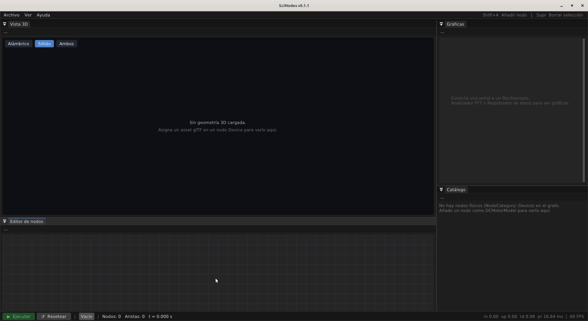

# Uso básico del editor

Al abrir SciNodes te recibe un canvas vacío con una barra de menús
arriba y una barra de estado abajo. Todo lo demás —agregar
nodos, ajustar parámetros, conectar bloques— pasa adentro del
canvas con el ratón y unos pocos atajos de teclado.

<figure>
  
  <figcaption>El editor recién abierto: canvas vacío + paneles laterales + status bar.</figcaption>
</figure>

## Insertar nodos

El gesto principal del editor es **Shift + A**. Lo pulsas con el
cursor sobre el canvas y aparece un popup contextual con el
catálogo agrupado por categoría: fuentes (señales y voltajes),
transformadores (ganancias, integradores, controladores,
modelos de planta) y sumideros (osciloscopio, FFT, plano de fase,
*logger* y un display de texto). Click sobre un tipo lo deja
puesto en el canvas exactamente donde abriste el popup.

Si no recuerdas el gesto, la esquina inferior del popup repite la
ayuda: *Shift+A* para abrir, *Esc* para cerrar sin insertar.

## Mover, seleccionar y borrar

Una vez en el canvas, los nodos se comportan como en cualquier
editor nodal moderno:

- Click sobre el cuerpo del nodo lo **selecciona** (borde
  resaltado).
- Click + arrastre lo **mueve**.
- **Delete** o **Backspace** borran lo que esté seleccionado
  —tanto nodos como aristas. Si borras un nodo, sus aristas
  asociadas se eliminan junto con él.

Para el canvas en sí, **Ctrl + rueda** hace zoom.

## Editar parámetros

Hay dos formas de tocar los parámetros de un nodo, según prefieras.

**Inline en el cuerpo del nodo.** Cada nodo expone sus parámetros
directamente en su cuerpo, como campos numéricos compactos. Cada
campo es un *slider*:

- **Drag** lateral cambia el valor de forma continua.
- **Doble click** sobre el campo te deja escribir un valor exacto.

**Panel flotante.** Un **doble click sobre el cuerpo del nodo**
(en una zona vacía, no sobre los *sliders*) abre un panel ImGui
flotante con los mismos parámetros, etiquetados y con más espacio
horizontal. Es útil cuando un nodo tiene seis o siete parámetros
y los *sliders* inline quedan apretados. El panel flotante y los
*sliders* inline editan el mismo estado: cualquier cambio en uno
se ve inmediatamente en el otro.

El cambio se aplica inmediatamente en cualquier modo. Si la
simulación está corriendo, el editor se lo manda al subproceso de
Scilab sin reiniciar la corrida (*live tuning*) —el efecto en
los plots se ve en menos de un *frame*.

Junto a cada valor aparece la unidad que el catálogo declara para
ese parámetro (por ejemplo `Hz`, `V`, `Ohm`, `Nm/A`). La unidad es
informativa en esta versión: no hay conversiones automáticas, sólo
una etiqueta para que recuerdes en qué dominio estás trabajando.

## Deshacer y rehacer

Cada cambio sobre el grafo —insertar, mover, borrar, cablear,
editar un parámetro— se registra como un *snapshot* en una pila
con capacidad para 50 estados. **Ctrl + Z** retrocede y **Ctrl + Y**
(o **Ctrl + Shift + Z**) avanza.

## El menú File

La barra de menús expone los flujos de archivo en el menú **File**:

- **New** (Ctrl+N) descarta el grafo actual. Si tiene cambios sin
  guardar te pide confirmación antes.
- **Open…** (Ctrl+O) abre el selector nativo (zenity en GTK o
  kdialog en KDE) para cargar un `.scn`. Si el archivo trae
  tipos de nodo que esta versión no reconoce, el editor abre el
  grafo en modo de sólo lectura y lista los problemas en la
  barra de estado.
- **Importar…** trae al canvas un fragmento de `.scn` (parámetros,
  sub-grafo, set de nodos) sin reemplazar lo que ya está abierto.
- **Importar modelo 3D…** agrega un asset glTF al catálogo de
  objetos del proyecto. Una vez importado, los nodos `Object 3D`
  pueden referenciarlo por nombre. Más detalle en
  [Escena 3-D](scene-3d.md).
- **Save** (Ctrl+S) sobrescribe el archivo abierto. Si nunca lo
  guardaste, cae a Save As.
- **Save As…** (Ctrl+Shift+S) pide una ruta nueva.
- **Save as Example** guarda el grafo actual dentro de la
  biblioteca local de ejemplos para reusarlo desde
  **Help → Ejemplos**.
- **Export →** tres opciones (todas requieren simulación
  ejecutada, sino el submenú aparece deshabilitado):
  - **CSV (un solo archivo)** — todos los sumideros en columnas
    en un mismo `.csv`.
  - **CSV (carpeta)** — un `.csv` por sumidero dentro de una
    carpeta nueva.
  - **SOD (formato Scilab)** — corrida completa a un `.sod` HDF5
    nativo de Scilab vía `ScilabBridge::exportSod`.
- **Quit** (Alt+F4) cierra el editor.

El menú **Help** ofrece `Ejemplos…` (abre el `ExamplesBrowser`
con la galería de fixtures) y `Sobre este grafo…` (panel para
editar autor, descripción y tags del documento; ver
[`AboutGraphPanel`](../dev/architecture.md)). El menú **View**
agrega un submenú `Idioma` con los idiomas disponibles
(`es` y `en` como tablas explícitas en `i18n/*.json`,
sincronizadas por el audit Capa 10). El cambio aplica en
runtime sin necesidad de relanzar la app.

## Resetear vistas y simulación

El menú **View** ofrece tres acciones sin atajo: *Reset Canvas*
vuelve el zoom y el desplazamiento del canvas a los valores por
defecto, *Reset Layout* reconstruye el dock de paneles en la
siguiente *frame*, y *Reset Simulation* detiene el subproceso de
Scilab y limpia los buffers de los sumideros. *Reset Simulation*
también está accesible desde el botón **↺ Reset** de la barra
de estado.

## Resumen de atajos

| Atajo            | Acción                                  |
|------------------|------------------------------------------|
| `Shift+A`        | Popup para insertar nodo                 |
| `Esc`            | Cerrar el popup sin insertar             |
| `Delete` / `Backspace` | Borrar nodos y aristas seleccionados |
| `Ctrl+Z`         | Undo                                     |
| `Ctrl+Y`         | Redo                                     |
| `Ctrl+Shift+Z`   | Redo (alias)                             |
| `Ctrl + rueda`   | Zoom del canvas                          |
| `Ctrl+Space`     | Maximizar el Area bajo el cursor (toggle) |
| `Ctrl+N`         | Nuevo grafo                              |
| `Ctrl+O`         | Abrir `.scn`                             |
| `Ctrl+S`         | Guardar                                  |
| `Ctrl+Shift+S`   | Guardar como                             |
| `Alt+F4`         | Salir                                    |
