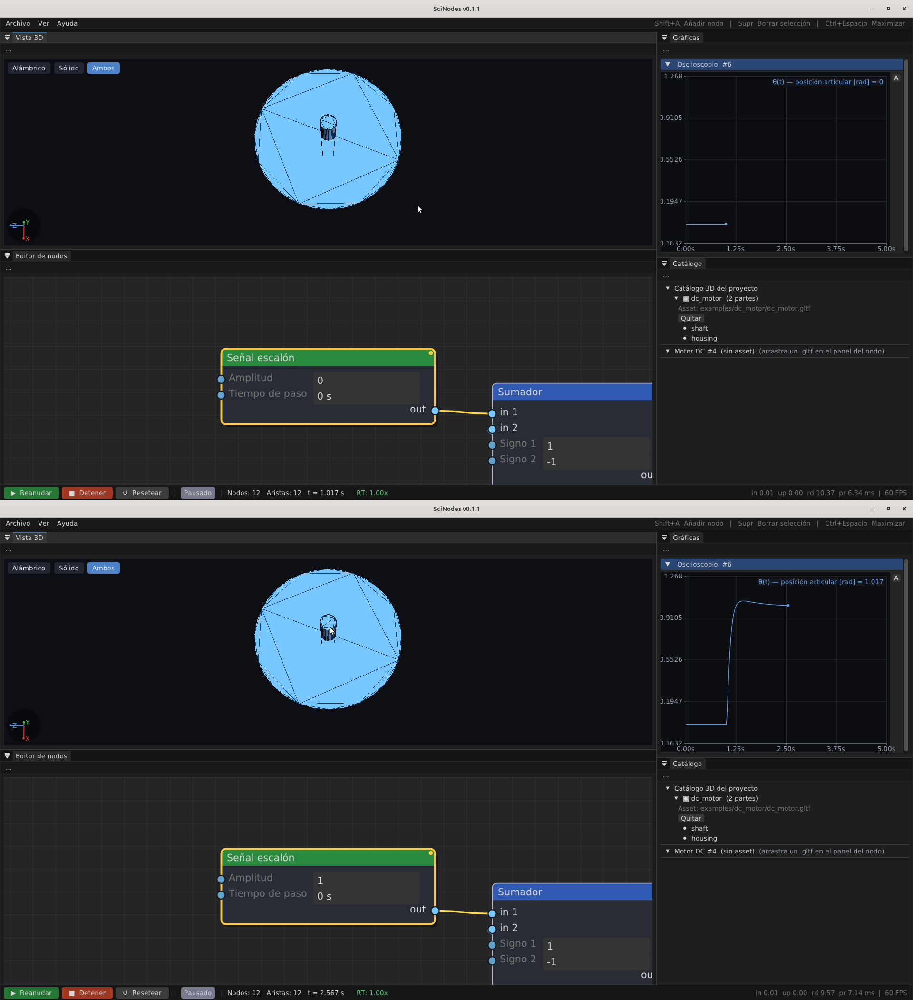

# Visor 3-D

<figure>
  
  <figcaption>Visor 3D mostrando el motor DC del ejemplo <code>E1_dc_3d</code>: el shaft rota con la θ viva del lazo.</figcaption>
</figure>

El visor 3-D es el panel donde SciNodes muestra lo que el motor
hace. A partir de esta versión está acoplado al solver: el ángulo
del eje del motor procedural en pantalla viene directo de un
sumidero del grafo. Si tienes un lazo cerrado PID + planta + sum
corriendo, el motor del visor gira con la velocidad calculada por
Scilab; si pausas la simulación, se detiene.

## El motor procedural

Por defecto el panel muestra un modelo del motor armado por
*shaders* propios —estator, rotor, eje y bobinas dibujados en
GLSL embebido—. No hace falta cargar ningún archivo desde disco:
los *shaders* SPIR-V se compilan en *build time* y quedan
embebidos en el binario.

La cámara es orbital alrededor del motor. Las interacciones del
ratón son las usuales:

- **Click izquierdo + arrastre** orbita la cámara.
- **Rueda** acerca o aleja.
- **Shift + arrastre** desplaza el punto de mira.

## Conectar el solver al motor: `View3DSink`

Para que el eje gire según la simulación tienes que cablear la
señal del ángulo a un nodo `3D View Sink`. El popup `Shift+A`
lo lista entre los sumideros, junto a `Oscilloscope`,
`FFT Analyzer`, etc.

Un grafo típico para ver girar el motor con un controlador
real:

```
StepSignal(50) → Summation(+,−) → PIDController → DCMotorModel ↺
                                                          ↓
                                                    3D View Sink
```

El `DCMotorModel` produce velocidad angular; un integrador
adicional o la conexión directa de la velocidad lleva la señal al
`3D View Sink`. El panel 3-D consulta su buffer en cada *frame*
y aplica el ángulo al eje del motor.

Mientras no haya un `View3DSink` cableado, el panel mantiene el
eje girando a 1 Hz como demostración estática: te muestra que el
*renderer* está vivo aunque el grafo no esté alimentándolo.

## Calentamiento del motor: `View3DThermalSink`

En v0.0.5 el visor lee un segundo sumidero opcional: el
`3D Thermal Tint`. Si lo tienes cableado a la salida de un nodo
térmico (`Thermal Mass`, `Thermal Node`), la malla del motor
procedural se colorea según la temperatura: azul al valor
`Cold Temperature` del sumidero (290 K por defecto) y rojo al
valor `Hot Temperature` (390 K). Los valores intermedios se
interpolan linealmente en el espacio HSV. El visor sigue
girando al mismo tiempo: el motor se ve rotando *y*
calentándose, no hay que elegir entre ambas vistas.

Si no hay `View3DThermalSink` en el grafo, el visor renderiza
con su color base; no se requiere configuración adicional.

## Deformación modal: `View3DDeformationSink`

A partir de v0.0.6 un tercer sumidero opcional anima la malla
con la forma del modo dominante. El `3D Deformation Overlay`
recibe tres canales —frecuencia, modo y amplitud— y el visor
aplica un desplazamiento radial por vértice sobre la malla
procedural:

```
Δr(θ, t) = A · cos(m · θ) · sin(2 · π · f · t)
```

El `Vulkan3DRenderer` cachea la malla base sin deformar al
inicializar y reescribe el VBO *host-coherent* con los
vértices desplazados antes de cada *submit*, sin
sincronización adicional. El motor sigue rotando (`View3DSink`)
y tiñendose (`View3DThermalSink`) al mismo tiempo: los tres
efectos se acumulan sobre la misma malla. Más detalles en
[Estructural y NVH](structural.md).

## El backend Vulkan

El visor usa un segundo *pipeline* Vulkan que renderiza
**offscreen** a una textura del tamaño del panel; esa textura
queda accesible a ImGui como `ImTextureID` y se dibuja con
`ImGui::Image`. Así el panel se integra al *dock space* del
editor sin necesitar una ventana propia y se puede redimensionar
libremente.

Si la inicialización del *renderer* Vulkan falla por cualquier
motivo (driver incompatible, memoria GPU insuficiente), el panel
no rompe el editor: cae a un modo en blanco con un mensaje, y el
resto de SciNodes sigue funcionando.

## Limitaciones de esta versión

- El motor *procedural* es único —siempre el mismo modelo—,
  pensado como demo acoplada al solver sin cargar nada de disco.
  Para otros equipos el visor **sí** renderiza modelos glTF
  externos: un nodo `Device` carga su malla (partes, *joints*,
  *anchors*) vinculada a un contrato de geometría y el visor la
  dibuja como *wireframe* o malla sólida (ver
  [Dispositivos](devices.md) y [Escena 3-D](scene-3d.md)). La
  carga de `.obj` / `.stl` heredada de *tags* anteriores quedó
  retirada en favor de glTF.
- No hay luces ni texturas; el render es plano por *shaders*.
  Suficiente para ver la rotación; insuficiente para escenas
  visualmente ricas.
