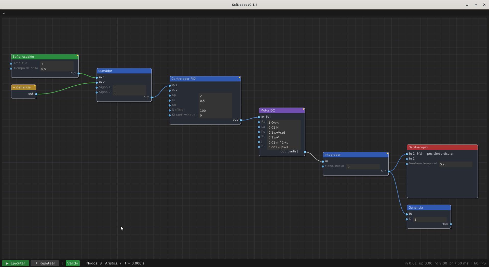

# Cablear nodos

<figure>
  
  <figcaption>Grafo del ejemplo <code>E1_dc</code> — lazo PID + Motor DC con feedback vía Alias.</figcaption>
</figure>

Cablear es el gesto central del editor: tomas el puerto de salida
de un nodo y lo arrastras al puerto de entrada de otro. SciNodes
valida cada conexión en el momento contra una gramática ligera de
ocho reglas. Si el cable rompe alguna regla, el editor lo rechaza
y muestra en la barra de estado el código de la regla y un
mensaje específico.

## Las reglas de conexión

Las reglas se evalúan en orden y la primera violación gana. Cada
una tiene un código y un mensaje listos para mostrarse:

| Código | Qué rechaza                                                       |
|--------|--------------------------------------------------------------------|
| `R3`   | Conexión de un nodo consigo mismo (*self-connection*).             |
| `R1`   | Salir desde un sumidero — los *sinks* no tienen puerto de salida.  |
| `R2`   | Entrar a una fuente — los *sources* no tienen puerto de entrada.   |
| `R4`   | Cable duplicado entre el mismo par de nodos.                       |
| `R5`   | El puerto de entrada destino ya está saturado.                     |
| `R6`   | Tipos de puerto incompatibles — p. ej. una señal a una entrada de geometría (usá un Transform Object para enlazarlas). |
| `R0`   | Categorías incompatibles. Sólo se permiten `S→T`, `S→Sk`, `T→T`, `T→Sk`. |
| `R7`   | Unidades incoherentes — el cable crearía una inconsistencia dimensional. Se chequea al agregar el cable y está activo por defecto. |

Cuando el cable se acepta, la conexión queda. Cuando se rechaza,
el editor te dice exactamente qué regla rompiste —por ejemplo,
*"All input ports of \"Summation\" are already connected."*
(`R5`)— y deshace el gesto.

## Puertos por nodo

La mayoría de los nodos del catálogo tienen una entrada y una
salida. Las excepciones se distinguen en el momento de cablear:

- **Las fuentes** —`Voltage Source`, `Current Source`,
  `Step Signal`, `Sine Signal`, `Ramp Signal`— no tienen
  puerto de entrada (rechazadas por `R2` si intentas conectarles
  algo). Tienen una salida.
- **Los sumideros** —`Oscilloscope`, `FFT Analyzer`,
  `Phase Portrait`, `Data Logger`, `Terminal Display`— no
  tienen puerto de salida (rechazadas por `R1` si intentas
  conectarlos a algo). Tienen una entrada, excepto `Phase
  Portrait` que pide dos: `in 1` para `x(t)`, `in 2` para
  `dx/dt(t)`.
- **`Summation`** acepta dos entradas (cada una con su signo
  configurable vía los parámetros `Sign1` y `Sign2`) y produce una
  salida.
- **`Inverse Kinematics`** es 2 a 2: dos entradas para el
  objetivo cartesiano `(x, y)` y dos salidas para los ángulos de
  junta `(θ1, θ2)` resueltos con la fórmula cerrada del IK planar
  de dos enlaces *elbow-up*. El nodo recorta el objetivo a la
  frontera del *workspace* (`|c2| ≤ 1`) cuando le pides un punto
  inalcanzable.

Todos los demás transformadores son 1 a 1.

## Ciclos y lazos cerrados

Un ciclo en el grafo no es rechazado por la gramática siempre que
contenga **al menos un nodo con estado** —`Integrator`,
`Differentiator`, `Low-Pass Filter`, `PID Controller`,
`Transfer Function`, `DC Motor Model`—. El generador de código
identifica ese nodo y lo usa como punto de ruptura del lazo: su
salida en el paso `n` se calcula a partir de su variable de
estado interna del paso `n−1`, no de su entrada cruda en el paso
`n`. La consecuencia práctica es que la salida observable en
tiempo `t` es el estado integrado hasta `t`, una semántica bien
definida.

Si construyes un ciclo *puramente combinacional* —todos los
nodos del ciclo sin estado—, la gramática no lo rechaza pero el
generador de código sí: no tiene un punto de ruptura natural y
falla al traducir el grafo a Scilab.

## Borrar conexiones

Click sobre el cable lo selecciona y **Delete** o **Backspace** lo
eliminan. Si borras un nodo, sus aristas asociadas se eliminan
junto con él, sin necesidad de borrarlas a mano.

## Alcanzabilidad

Aunque un grafo respete R0–R7 puede no producir ninguna
observación. SciNodes hace un BFS desde cada fuente hacia los
sumideros y, si ningún sumidero es alcanzable, muestra una
advertencia en la barra de estado. No bloquea la edición —el
aviso es informativo—, pero te dice que el grafo no va a entregar
nada a los plots cuando pulses Run.
